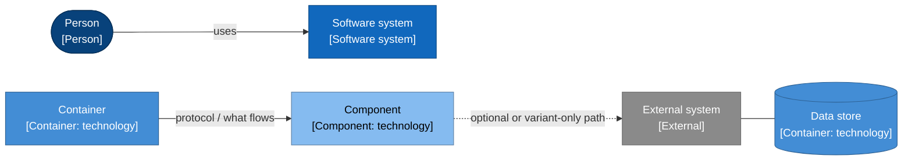
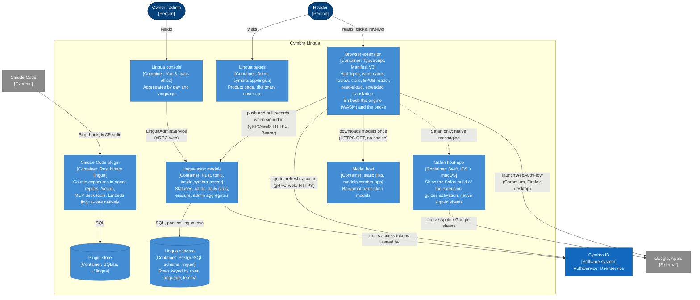
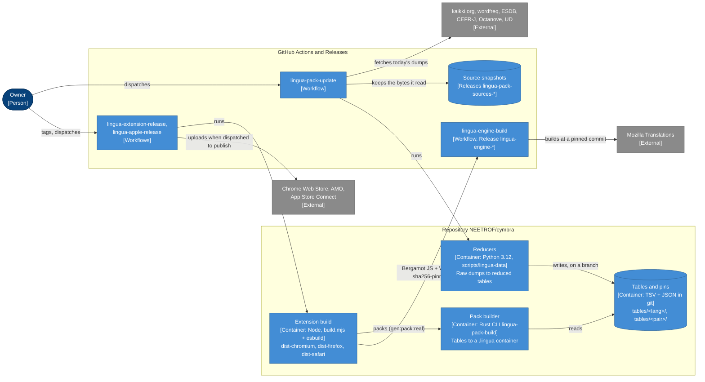

# Cymbra Lingua — architecture (C4)

How Cymbra Lingua works as a whole: what it is made of, how the parts talk to each other, where
the reader's data lives, and how a dictionary becomes a pack in a reader's browser. It follows the
[C4 model](https://c4model.com): system context (C1), containers (C2), components (C3) and code
(C4), plus dynamic views of the flows that matter most.

- Written against `main` at `ce706b3a` (2026-10-08): extension 1.7.0, Safari host app 1.5.0
  (`.release-please-manifest.json`).
- Paths are relative to the repository root. `file:line` anchors were checked on that commit; lines
  drift as code moves, the symbol named beside them is the stable part.
- It describes what is **shipped**. Work in progress is named as such, and section 9 lists what this
  document found inconsistent or could not settle.

## Contents

- [Reading this document](#reading-this-document)
- [What Lingua is, in one minute](#what-lingua-is-in-one-minute)
- [1. System context (C1)](#1-system-context-c1)
- [2. Containers (C2)](#2-containers-c2)
- [3. Components (C3)](#3-components-c3)
- [4. Code (C4): the engine's core types](#4-code-c4-the-engines-core-types)
- [5. Dynamic views](#5-dynamic-views)
- [6. Where data lives](#6-where-data-lives)
- [7. Deployment](#7-deployment)
- [8. Glossary](#8-glossary)
- [9. Open points](#9-open-points)
- [10. Further reading](#10-further-reading)

## Reading this document

| Level | Question it answers | Here |
|---|---|---|
| C1 System context | Who uses Lingua, and which outside systems does it depend on? | [§1](#1-system-context-c1) |
| C2 Containers | Which separately built and run pieces make up Lingua, and how do they talk? | [§2](#2-containers-c2) — the centrepiece |
| C3 Components | Inside the containers where the logic lives: the extension, the engine, the sync module | [§3](#3-components-c3) |
| C4 Code | The engine's central Rust types | [§4](#4-code-c4-the-engines-core-types) |
| Dynamic | The same elements, in time: reading, marking and syncing, building a pack, translating | [§5](#5-dynamic-views) |

The diagrams are Mermaid `flowchart`s drawn with C4's conventions rather than Mermaid's own C4
syntax, which lays out poorly at this size. Every box says its name, its kind and technology in
brackets, and one line of responsibility; every arrow says what flows and, where it matters, over
which protocol. A dashed frame is a boundary (a software system, a process, a browser context).

## What Lingua is, in one minute

Cymbra Lingua helps a reader learn a language **by reading what they already read**. Where they
read — a web page, an EPUB book, the replies of a coding agent — it highlights the words they do
not know yet, shows each one's meaning in their native language (a *gloss* from a dictionary, never
a machine translation), and gives an honest percentage of the page they understand. The reader
marks words (*known*, *learning*, *ignored*); learning words become cards reviewed with spaced
repetition (FSRS); reading itself is counted as exposure and can confirm words the reader already
knows.

Three properties shape the architecture:

1. **Local-first.** Reading, statuses, decks, review and statistics work with no account and no
   network. The dictionary ships inside the package as a *pack*; the analysis engine runs on the
   device. An optional Cymbra ID account turns on cross-device sync of statuses, cards and daily
   statistics — never page text, URLs or reading history (`openspec/specs/lingua-sync`,
   `openspec/specs/lingua-privacy`).
2. **One engine, everywhere.** The same Rust crate, `lingua-core`, analyses text in the browser
   (compiled to WebAssembly) and in the Claude Code plugin (natively), with byte-identical output
   at equal analyser version and pack (`crates/lingua-core/src/lib.rs:17-22`).
3. **One extension source, three browsers.** Chromium, Firefox (desktop and Android) and Safari
   (macOS and iOS, inside a host app) are built from one TypeScript source; what differs per browser
   is decided at build time (`apps/lingua-extension/build.mjs:142-155`).

**Languages shipped today.** The pairs a package ships are the list in
`apps/lingua-extension/packs.json`: **`en-fr`** (English for French speakers) and **`es-fr`**
(Spanish for French speakers). The interface copy exists in French, English and Spanish
(`apps/lingua-extension/src/i18n/`). The direction is the
[language matrix programme](language-matrix-programme.md) — every language of {English, French,
Spanish} studied from the other two. Some of it is already in the repository without being shipped:
the `en-es` and `es-en` tables (`scripts/lingua-data/tables/`), their translation models and routes
(`apps/lingua-extension/model-manifest.json`), and French as a studied language in the engine
(`StudiedLanguage::French`, analyser `0.1.0`).

## 1. System context (C1)

The **reader** meets Lingua in their browser, in the Safari host app on Apple devices, and in
Claude Code. Everything they need to read is on their device; Lingua calls out only when they sign
in (Cymbra ID, and Google or Apple for the id_token), sync, or turn on extended translation (a
one-time model download). **Cymbra ID** is the account system Cymbra Music already uses: Lingua
does not have accounts of its own, it asks Cymbra ID for tokens with the audience `lingua`
(`apps/lingua-extension/src/state/session.ts:34`).

The **owner** works through GitHub: a workflow refreshes the dictionary from its sources, another
builds the translation engine, others release the extension and the host app and submit them to the
stores. The only Lingua screen the owner reads at run time is the back office's aggregate console.

| Element | What it is | Where in the repo |
|---|---|---|
| Cymbra Lingua | The product: extension, Safari host app, Claude Code plugin, sync module, packs, models | `apps/lingua-extension`, `apps/lingua-apple`, `apps/lingua-agent`, `crates/lingua-*`, `backend/lingua`, `scripts/lingua-data` |
| Cymbra ID | Auth and account services shared by every Cymbra product | `backend/auth`, `backend/user`, `backend/auth-port/proto/auth.proto`, `backend/user-port/proto/user.proto` |
| Google, Apple | OpenID Connect providers; the extension or the host app obtains an id_token, Cymbra ID verifies it | `apps/lingua-extension/src/state/oidc.ts`, `apps/lingua-apple/LinguaSignIn/`, `backend/platform/src/config.rs` (`CYMBRA_GOOGLE_AUDIENCE`, `CYMBRA_APPLE_AUDIENCE`) |
| Stores | Where readers install Lingua; uploads are a deliberate dispatch, never a side effect of a merge | `.github/workflows/lingua-extension-release.yml`, `.github/workflows/lingua-apple-release.yml`, `apps/lingua-extension/STORE-LISTING.md` |
| Dictionary sources | Raw data the packs are reduced from, pinned by sha256 | `scripts/lingua-data/SOURCES.md`, `scripts/lingua-data/tables/<pair>/pin.json` |
| Mozilla Translations | Source of the Bergamot engine (built by our CI at a pinned commit) and of the translation models | `apps/lingua-extension/engine-pin.json`, `apps/lingua-extension/model-manifest.json`, `apps/lingua-extension/TRANSLATION.md` |
| GitHub | CI, releases of packages, engine, model mirror and source snapshots | `.github/workflows/lingua-*.yml` |
| Claude Code | Runs the plugin's `Stop` hook and MCP server | `apps/lingua-agent/hooks/hooks.json`, `apps/lingua-agent/.mcp.json` |

## 2. Containers (C2)

Lingua has two faces: what runs while someone reads (§2.1), and what turns sources into the
packages they install (§2.3). Between the two sits the one fact that explains most of the
extension's design: the same source is built three ways (§2.2).

### 2.1 Runtime containers

**The browser extension is where Lingua happens.** It reads the page, runs the engine, paints the
highlights, owns the reader's data in the browser's IndexedDB, and — only when the reader signs in
— exchanges records with the sync module. Its packs are part of the package: nothing about reading
needs the network. Turning on « Traduction étendue » downloads translation models once from the
model host; the translation engine itself is part of the package, because the stores treat
WebAssembly fetched from elsewhere as remote code (`apps/lingua-extension/build.mjs:31-38`).

**The Safari host app** exists because Apple distributes Safari extensions only inside an app. It
copies `dist-safari/` into its extension target at build time and adds the one thing Safari lacks:
a way to sign in with Apple or Google (no `identity.launchWebAuthFlow` there). The app runs the
native sheet and leaves the id_token in an App Group; the extension collects it over native
messaging (`apps/lingua-apple/README.md`, `apps/lingua-extension/src/state/native-signin.ts`).

**The Claude Code plugin** is a separate, local-only product surface: a `Stop` hook runs
`lingua ingest` after each reply, an MCP server exposes `list_decks`, `add_words`, `due_cards` and
`answer_card`. It links `lingua-core` natively, keeps its own SQLite store under `~/.lingua/`, opens
no network connection and is not synced (`apps/lingua-agent/README.md`).

**The sync module** is a Rust crate, `cymbra-lingua`, mounted into the shared `cymbra-server` next
to Cymbra ID's services. It never sees a backup blob: it stores one row per status, card, declared
level and day, merged last-write-wins (§3.4). It is inert until `CYMBRA_LINGUA_DATABASE_URL` is set
(`backend/server/src/main.rs:786-845`).

The **Lingua pages** of the site and the **Lingua console** of the back office are parts of
containers shared with the rest of Cymbra (`apps/site`, `apps/back-office`); they are drawn here
because they are Lingua's. The site page is static: its coverage figures are computed from the
committed tables at build time (`scripts/lingua-data/gloss_coverage.py`,
`apps/site/src/data/lingua-coverage.json`) and it signs no one in.

| Container | Technology | Responsibility | Where in the repo (entry points) |
|---|---|---|---|
| Browser extension | TypeScript, MV3, esbuild, Connect-ES, foliate-js | Reading, cards, review, stats, EPUB reader, read-aloud, translation, local store, sync client | `apps/lingua-extension/src/content.ts:43` (`bootstrap`), `src/background.ts`, `build.mjs`, `manifest.json` |
| Safari host app | Swift (UIKit/AppKit, SwiftUI sheet), Xcode | Distribution on iOS/macOS, activation page, Apple/Google sheets, id_token hand-off | `apps/lingua-apple/Shared (Extension)/SafariWebExtensionHandler.swift`, `apps/lingua-apple/LinguaSignIn/Sources/LinguaSignIn/` |
| Claude Code plugin | Rust (`lingua-core` + `rusqlite`), JSON-RPC over stdio | Exposure counting from transcripts, `/vocab`, MCP deck and review tools | `apps/lingua-agent/rust/src/main.rs:71`, `rust/src/mcp.rs:51-63` (tool catalogue), `rust/src/ingest.rs` |
| Plugin store | SQLite | Exposures, statuses, cards, ingest offsets of the plugin | `apps/lingua-agent/rust/src/store.rs:92` (`Store`) |
| Lingua sync module | Rust, tonic, sqlx | `KnownWordsService`, `DeckService`, `StatsService`, `LinguaDataService`, `LinguaAdminService` | `backend/lingua/src/lib.rs`, `backend/lingua/proto/*.proto`, wiring `backend/server/src/main.rs:786-845` |
| Lingua schema | PostgreSQL 16, schema `lingua`, role `lingua_svc` | Durable copy of the reader's synced records | `backend/lingua/migrations/0001_lingua.sql` … `0006_lingua_native_language.sql`, `backend/db/init/roles.sql.tpl:111-125` |
| Model host | Static files on Cloudflare Pages | Serves the model files the package's catalogue pins by sha256 | `apps/lingua-extension/model-manifest.json:2`, `.github/workflows/lingua-model-deploy.yml` |
| Lingua pages | Astro (static) | Product page per interface language, coverage per shipped pair | `apps/site/src/pages/lingua.astro`, `apps/site/src/components/LinguaPage.astro`, `apps/site/src/lib/lingua-pairs.ts` |
| Lingua console | Vue 3, Pinia | Aggregate usage, gated by `admin` in the `lingua` scope | `apps/back-office/src/views/LinguaView.vue`, `src/stores/lingua.ts:90`, route `src/router.ts:53` |
| Cymbra ID | Rust (`backend/auth`, `backend/user`) | Tokens for the audience `lingua`, account profile | `backend/auth-port/proto/auth.proto:54-70`, `backend/user-port/proto/user.proto:175-181` |

The worker (`cymbra-worker`) also touches the Lingua schema, for two background jobs: an optional
weekly Discord report of aggregates, on a small `lingua_svc` pool
(`backend/worker/src/discord.rs:112-134`), and the deletion of an account's rows when the account is
purged, on the `admin_svc` pool (`backend/worker/src/lib.rs`, `purge_user`).

### 2.2 One source, three browser builds

`build.mjs` builds `dist-chromium/`, `dist-firefox/` and `dist-safari/` from the same `src/`, and
folds each variant's branches away with esbuild defines (`capabilities`, `build.mjs:142-155`). The
differences are platform truths, not preferences (`.claude/skills/browser-extension-architecture/SKILL.md`):

| | Chromium (Chrome, Edge) | Firefox (desktop and Android, one zip) | Safari (macOS, iOS) |
|---|---|---|---|
| Background | ES-module service worker | classic event page | classic, non-persistent event page |
| Where the reading engine runs | in the content script (`WasmAnalyzerPort`); the background's engine only for pages whose CSP blocks WASM | in the event page, reached over messaging (`MessagingLinguaPort`) — Firefox's content-script CSP blocks WASM | in the event page, as Firefox |
| Reader injection | activeTab-first: popup's « Analyser cette page », or dynamic registration after the optional `<all_urls>` grant | static `content_scripts` on `<all_urls>` | static `content_scripts` on `<all_urls>` |
| Review surface | native Side Panel (`sidepanel.html`) | in-page drawer | in-page drawer |
| Translation engine host | an offscreen document owns the workers (a service worker cannot construct one) | the event page owns the workers | the event page owns the workers |
| Apple / Google sign-in | `identity.launchWebAuthFlow` | `identity.launchWebAuthFlow` (absent on Android: email only) | host app over native messaging |
| EPUB sections | served by the service worker from Cache Storage | `blob:` URLs | `blob:` URLs |
| Ships through | Chrome Web Store | addons.mozilla.org | the host app, App Store |

Defines: `__ENGINE_IN_EVENT_PAGE__`, `__REVIEW_IN_PAGE__`, `__STATIC_READER__` (all three: not
Chromium), `__NATIVE_PROVIDERS__` (Safari), `__SECTIONS_FROM_WORKER__` (Chromium),
`__TRANSLATION_HOST__` (`offscreen` on Chromium, `event-page` elsewhere — `translationHost`,
`build.mjs:110-114`).

### 2.3 Build and delivery containers

Four rules make this pipeline reproducible (`scripts/lingua-data/SOURCES.md:3-19`):

- **Raw sources are never committed; what is built from them is.** A pack is rebuilt from the
  committed tables, offline, in seconds, by every pull request and every release — and must match the
  sha256 recorded in that pair's `pin.json` (`scripts/lingua-data/build.sh:115-132`).
- **Only one workflow reads the internet for data.** `lingua-pack-update` fetches today's dumps,
  stores the exact bytes as a GitHub Release (`lingua-pack-sources-<pair>-<snapshot>`), reduces them,
  and pushes a branch; a person opens the pull request. A monthly cron runs it dry
  (`.github/workflows/lingua-pack-update.yml`).
- **Nothing the extension runs is downloaded at build time except the Bergamot engine**, which our
  own `lingua-engine-build` workflow compiled from a pinned `mozilla/translations` commit and which
  the build refuses unless its bytes match `engine-pin.json` (`build.mjs:105-125`). The Lingua WASM
  is built in each job with wasm-pack (`tool/gen_wasm.sh`), the packs with `lingua-pack-build`.
- **A release is not a deployment.** A `lingua-extension-v*` tag builds every variant and attaches
  the Chromium and Firefox zips to the GitHub Release; reaching a store is a separate dispatch with
  `publish` ticked (`apps/lingua-extension/README.md`, *Release*). The Safari build reaches readers
  only through `lingua-apple-release`.

The models follow a separate path: `lingua-model-deploy` (dispatch only) assembles the files named
in `model-manifest.json` from Mozilla's registry or our mirror releases (`lingua-model-*`), checks
both digests, and deploys them to Cloudflare Pages behind `models.cymbra.app`
(`.github/workflows/lingua-model-deploy.yml`, `apps/lingua-extension/tool/assemble_model_site.mjs`).

| Container | Responsibility | Where in the repo |
|---|---|---|
| Reducers | Turn raw dumps into the committed tables of one pair (glosses, expressions, senses) and of its studied language (forms, ranks, levels, readings, dictionary words) | `scripts/lingua-data/reduce-<pair>.py`, `reduce_common.py`, `reduce_edition_{en,fr,es}.py` |
| Source pinning | Fetch, record and verify raw sources; split tables per language; record the built pack's sha256 | `scripts/lingua-data/pack_sources.py` (`fetch-pinned`, `fetch-live`, `split`, `record-build`, `check-pack`) |
| Tables and pins | The reviewed, licensed input of every pack | `scripts/lingua-data/tables/{en,es}/`, `tables/{en-fr,es-fr,en-es,es-en}/`, each pair's `pin.json` and `manifest.json` |
| Pack builder | Assemble and size-check (5 MiB) a `.lingua` container | `crates/lingua-pack/src/bin/lingua-pack-build.rs:61` (`run`), `crates/lingua-pack/src/lib.rs:463` (`build_pack`) |
| Extension build | Bundle each variant, copy the shipped packs, the WASM, the engine and the model catalogue, write each manifest | `apps/lingua-extension/build.mjs`, `tool/gen_pack.sh`, `tool/gen_wasm.sh`, `tool/fetch_engine.sh`, `tool/manifests.mjs`, gate `tool/check_variants.mjs` |
| Pull-request gate | Rebuild every pair's pack against its pin, Rust baselines, extension lint and tests, re-reduce when the pipeline changes | `.github/workflows/lingua-extension-check.yml`, `.github/workflows/rust.yml` |
| Releases | Version from release-please (`lingua-extension`, `lingua-apple` components); build, attach, submit on dispatch | `.github/workflows/lingua-extension-release.yml`, `.github/workflows/lingua-apple-release.yml`, `release-please-config.json` |
| Engine build | Bergamot from a pinned commit, published as `lingua-engine-<commit>` | `.github/workflows/lingua-engine-build.yml`, `apps/lingua-extension/engine-pin.json`, `tool/build_engine.sh` |
| Model deploy | Mirror and host the pinned models | `.github/workflows/lingua-model-deploy.yml`, `tool/mirror_models.mjs`, `tool/check_model_host.mjs` |

