# Cymbra Lingua — architecture (C4)

How Cymbra Lingua works as a whole: what it is made of, how the parts talk to each other, where
the reader's data lives, and how a dictionary becomes a pack in a reader's browser. It follows the
[C4 model](https://c4model.com): system context (C1), containers (C2), components (C3) and code
(C4), plus dynamic views of the flows that matter most.

- Written against `main` at `ce706b3a` (2026-10-08): extension 1.7.0, Safari host app 1.5.0
  (`.release-please-manifest.json`).
- Paths are relative to the repository root. `file:line` anchors were checked on that commit; lines
  drift as code moves, the symbol named beside them is the stable part.
- It describes what is **shipped**. Work in progress is named as such, and section 9 lists what this
  document found inconsistent or could not settle.

## Contents

- [Reading this document](#reading-this-document)
- [What Lingua is, in one minute](#what-lingua-is-in-one-minute)
- [1. System context (C1)](#1-system-context-c1)
- [2. Containers (C2)](#2-containers-c2)
- [3. Components (C3)](#3-components-c3)
- [4. Code (C4): the engine's core types](#4-code-c4-the-engines-core-types)
- [5. Dynamic views](#5-dynamic-views)
- [6. Where data lives](#6-where-data-lives)
- [7. Deployment](#7-deployment)
- [8. Glossary](#8-glossary)
- [9. Open points](#9-open-points)
- [10. Further reading](#10-further-reading)

## Reading this document

| Level | Question it answers | Here |
|---|---|---|
| C1 System context | Who uses Lingua, and which outside systems does it depend on? | [§1](#1-system-context-c1) |
| C2 Containers | Which separately built and run pieces make up Lingua, and how do they talk? | [§2](#2-containers-c2) — the centrepiece |
| C3 Components | Inside the containers where the logic lives: the extension, the engine, the sync module | [§3](#3-components-c3) |
| C4 Code | The engine's central Rust types | [§4](#4-code-c4-the-engines-core-types) |
| Dynamic | The same elements, in time: reading, marking and syncing, building a pack, translating | [§5](#5-dynamic-views) |

The diagrams are Mermaid `flowchart`s drawn with C4's conventions rather than Mermaid's own C4
syntax, which lays out poorly at this size. Every box says its name, its kind and technology in
brackets, and one line of responsibility; every arrow says what flows and, where it matters, over
which protocol. A dashed frame is a boundary (a software system, a process, a browser context).

## What Lingua is, in one minute

Cymbra Lingua helps a reader learn a language **by reading what they already read**. Where they
read — a web page, an EPUB book, the replies of a coding agent — it highlights the words they do
not know yet, shows each one's meaning in their native language (a *gloss* from a dictionary, never
a machine translation), and gives an honest percentage of the page they understand. The reader
marks words (*known*, *learning*, *ignored*); learning words become cards reviewed with spaced
repetition (FSRS); reading itself is counted as exposure and can confirm words the reader already
knows.

Three properties shape the architecture:

1. **Local-first.** Reading, statuses, decks, review and statistics work with no account and no
   network. The dictionary ships inside the package as a *pack*; the analysis engine runs on the
   device. An optional Cymbra ID account turns on cross-device sync of statuses, cards and daily
   statistics — never page text, URLs or reading history (`openspec/specs/lingua-sync`,
   `openspec/specs/lingua-privacy`).
2. **One engine, everywhere.** The same Rust crate, `lingua-core`, analyses text in the browser
   (compiled to WebAssembly) and in the Claude Code plugin (natively), with byte-identical output
   at equal analyser version and pack (`crates/lingua-core/src/lib.rs:17-22`).
3. **One extension source, three browsers.** Chromium, Firefox (desktop and Android) and Safari
   (macOS and iOS, inside a host app) are built from one TypeScript source; what differs per browser
   is decided at build time (`apps/lingua-extension/build.mjs:142-155`).

**Languages shipped today.** The pairs a package ships are the list in
`apps/lingua-extension/packs.json`: **`en-fr`** (English for French speakers) and **`es-fr`**
(Spanish for French speakers). The interface copy exists in French, English and Spanish
(`apps/lingua-extension/src/i18n/`). The direction is the
[language matrix programme](language-matrix-programme.md) — every language of {English, French,
Spanish} studied from the other two. Some of it is already in the repository without being shipped:
the `en-es` and `es-en` tables (`scripts/lingua-data/tables/`), their translation models and routes
(`apps/lingua-extension/model-manifest.json`), and French as a studied language in the engine
(`StudiedLanguage::French`, analyser `0.1.0`).

## 1. System context (C1)

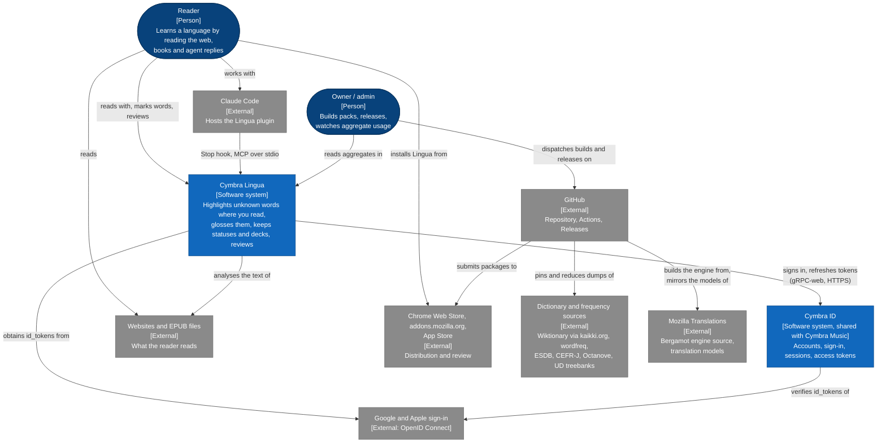

The **reader** meets Lingua in their browser, in the Safari host app on Apple devices, and in
Claude Code. Everything they need to read is on their device; Lingua calls out only when they sign
in (Cymbra ID, and Google or Apple for the id_token), sync, or turn on extended translation (a
one-time model download). **Cymbra ID** is the account system Cymbra Music already uses: Lingua
does not have accounts of its own, it asks Cymbra ID for tokens with the audience `lingua`
(`apps/lingua-extension/src/state/session.ts:34`).

The **owner** works through GitHub: a workflow refreshes the dictionary from its sources, another
builds the translation engine, others release the extension and the host app and submit them to the
stores. The only Lingua screen the owner reads at run time is the back office's aggregate console.

| Element | What it is | Where in the repo |
|---|---|---|
| Cymbra Lingua | The product: extension, Safari host app, Claude Code plugin, sync module, packs, models | `apps/lingua-extension`, `apps/lingua-apple`, `apps/lingua-agent`, `crates/lingua-*`, `backend/lingua`, `scripts/lingua-data` |
| Cymbra ID | Auth and account services shared by every Cymbra product | `backend/auth`, `backend/user`, `backend/auth-port/proto/auth.proto`, `backend/user-port/proto/user.proto` |
| Google, Apple | OpenID Connect providers; the extension or the host app obtains an id_token, Cymbra ID verifies it | `apps/lingua-extension/src/state/oidc.ts`, `apps/lingua-apple/LinguaSignIn/`, `backend/platform/src/config.rs` (`CYMBRA_GOOGLE_AUDIENCE`, `CYMBRA_APPLE_AUDIENCE`) |
| Stores | Where readers install Lingua; uploads are a deliberate dispatch, never a side effect of a merge | `.github/workflows/lingua-extension-release.yml`, `.github/workflows/lingua-apple-release.yml`, `apps/lingua-extension/STORE-LISTING.md` |
| Dictionary sources | Raw data the packs are reduced from, pinned by sha256 | `scripts/lingua-data/SOURCES.md`, `scripts/lingua-data/tables/<pair>/pin.json` |
| Mozilla Translations | Source of the Bergamot engine (built by our CI at a pinned commit) and of the translation models | `apps/lingua-extension/engine-pin.json`, `apps/lingua-extension/model-manifest.json`, `apps/lingua-extension/TRANSLATION.md` |
| GitHub | CI, releases of packages, engine, model mirror and source snapshots | `.github/workflows/lingua-*.yml` |
| Claude Code | Runs the plugin's `Stop` hook and MCP server | `apps/lingua-agent/hooks/hooks.json`, `apps/lingua-agent/.mcp.json` |

## 2. Containers (C2)

Lingua has two faces: what runs while someone reads (§2.1), and what turns sources into the
packages they install (§2.3). Between the two sits the one fact that explains most of the
extension's design: the same source is built three ways (§2.2).

### 2.1 Runtime containers

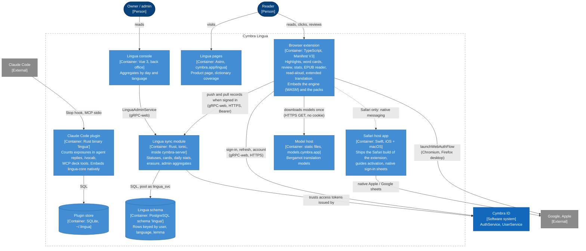

**The browser extension is where Lingua happens.** It reads the page, runs the engine, paints the
highlights, owns the reader's data in the browser's IndexedDB, and — only when the reader signs in
— exchanges records with the sync module. Its packs are part of the package: nothing about reading
needs the network. Turning on « Traduction étendue » downloads translation models once from the
model host; the translation engine itself is part of the package, because the stores treat
WebAssembly fetched from elsewhere as remote code (`apps/lingua-extension/build.mjs:31-38`).

**The Safari host app** exists because Apple distributes Safari extensions only inside an app. It
copies `dist-safari/` into its extension target at build time and adds the one thing Safari lacks:
a way to sign in with Apple or Google (no `identity.launchWebAuthFlow` there). The app runs the
native sheet and leaves the id_token in an App Group; the extension collects it over native
messaging (`apps/lingua-apple/README.md`, `apps/lingua-extension/src/state/native-signin.ts`).

**The Claude Code plugin** is a separate, local-only product surface: a `Stop` hook runs
`lingua ingest` after each reply, an MCP server exposes `list_decks`, `add_words`, `due_cards` and
`answer_card`. It links `lingua-core` natively, keeps its own SQLite store under `~/.lingua/`, opens
no network connection and is not synced (`apps/lingua-agent/README.md`).

**The sync module** is a Rust crate, `cymbra-lingua`, mounted into the shared `cymbra-server` next
to Cymbra ID's services. It never sees a backup blob: it stores one row per status, card, declared
level and day, merged last-write-wins (§3.4). It is inert until `CYMBRA_LINGUA_DATABASE_URL` is set
(`backend/server/src/main.rs:786-845`).

The **Lingua pages** of the site and the **Lingua console** of the back office are parts of
containers shared with the rest of Cymbra (`apps/site`, `apps/back-office`); they are drawn here
because they are Lingua's. The site page is static: its coverage figures are computed from the
committed tables at build time (`scripts/lingua-data/gloss_coverage.py`,
`apps/site/src/data/lingua-coverage.json`) and it signs no one in.

| Container | Technology | Responsibility | Where in the repo (entry points) |
|---|---|---|---|
| Browser extension | TypeScript, MV3, esbuild, Connect-ES, foliate-js | Reading, cards, review, stats, EPUB reader, read-aloud, translation, local store, sync client | `apps/lingua-extension/src/content.ts:43` (`bootstrap`), `src/background.ts`, `build.mjs`, `manifest.json` |
| Safari host app | Swift (UIKit/AppKit, SwiftUI sheet), Xcode | Distribution on iOS/macOS, activation page, Apple/Google sheets, id_token hand-off | `apps/lingua-apple/Shared (Extension)/SafariWebExtensionHandler.swift`, `apps/lingua-apple/LinguaSignIn/Sources/LinguaSignIn/` |
| Claude Code plugin | Rust (`lingua-core` + `rusqlite`), JSON-RPC over stdio | Exposure counting from transcripts, `/vocab`, MCP deck and review tools | `apps/lingua-agent/rust/src/main.rs:71`, `rust/src/mcp.rs:51-63` (tool catalogue), `rust/src/ingest.rs` |
| Plugin store | SQLite | Exposures, statuses, cards, ingest offsets of the plugin | `apps/lingua-agent/rust/src/store.rs:92` (`Store`) |
| Lingua sync module | Rust, tonic, sqlx | `KnownWordsService`, `DeckService`, `StatsService`, `LinguaDataService`, `LinguaAdminService` | `backend/lingua/src/lib.rs`, `backend/lingua/proto/*.proto`, wiring `backend/server/src/main.rs:786-845` |
| Lingua schema | PostgreSQL 16, schema `lingua`, role `lingua_svc` | Durable copy of the reader's synced records | `backend/lingua/migrations/0001_lingua.sql` … `0006_lingua_native_language.sql`, `backend/db/init/roles.sql.tpl:111-125` |
| Model host | Static files on Cloudflare Pages | Serves the model files the package's catalogue pins by sha256 | `apps/lingua-extension/model-manifest.json:2`, `.github/workflows/lingua-model-deploy.yml` |
| Lingua pages | Astro (static) | Product page per interface language, coverage per shipped pair | `apps/site/src/pages/lingua.astro`, `apps/site/src/components/LinguaPage.astro`, `apps/site/src/lib/lingua-pairs.ts` |
| Lingua console | Vue 3, Pinia | Aggregate usage, gated by `admin` in the `lingua` scope | `apps/back-office/src/views/LinguaView.vue`, `src/stores/lingua.ts:90`, route `src/router.ts:53` |
| Cymbra ID | Rust (`backend/auth`, `backend/user`) | Tokens for the audience `lingua`, account profile | `backend/auth-port/proto/auth.proto:54-70`, `backend/user-port/proto/user.proto:175-181` |

The worker (`cymbra-worker`) also touches the Lingua schema, for two background jobs: an optional
weekly Discord report of aggregates, on a small `lingua_svc` pool
(`backend/worker/src/discord.rs:112-134`), and the deletion of an account's rows when the account is
purged, on the `admin_svc` pool (`backend/worker/src/lib.rs`, `purge_user`).

### 2.2 One source, three browser builds

`build.mjs` builds `dist-chromium/`, `dist-firefox/` and `dist-safari/` from the same `src/`, and
folds each variant's branches away with esbuild defines (`capabilities`, `build.mjs:142-155`). The
differences are platform truths, not preferences (`.claude/skills/browser-extension-architecture/SKILL.md`):

| | Chromium (Chrome, Edge) | Firefox (desktop and Android, one zip) | Safari (macOS, iOS) |
|---|---|---|---|
| Background | ES-module service worker | classic event page | classic, non-persistent event page |
| Where the reading engine runs | in the content script (`WasmAnalyzerPort`); the background's engine only for pages whose CSP blocks WASM | in the event page, reached over messaging (`MessagingLinguaPort`) — Firefox's content-script CSP blocks WASM | in the event page, as Firefox |
| Reader injection | activeTab-first: popup's « Analyser cette page », or dynamic registration after the optional `<all_urls>` grant | static `content_scripts` on `<all_urls>` | static `content_scripts` on `<all_urls>` |
| Review surface | native Side Panel (`sidepanel.html`) | in-page drawer | in-page drawer |
| Translation engine host | an offscreen document owns the workers (a service worker cannot construct one) | the event page owns the workers | the event page owns the workers |
| Apple / Google sign-in | `identity.launchWebAuthFlow` | `identity.launchWebAuthFlow` (absent on Android: email only) | host app over native messaging |
| EPUB sections | served by the service worker from Cache Storage | `blob:` URLs | `blob:` URLs |
| Ships through | Chrome Web Store | addons.mozilla.org | the host app, App Store |

Defines: `__ENGINE_IN_EVENT_PAGE__`, `__REVIEW_IN_PAGE__`, `__STATIC_READER__` (all three: not
Chromium), `__NATIVE_PROVIDERS__` (Safari), `__SECTIONS_FROM_WORKER__` (Chromium),
`__TRANSLATION_HOST__` (`offscreen` on Chromium, `event-page` elsewhere — `translationHost`,
`build.mjs:110-114`).

### 2.3 Build and delivery containers

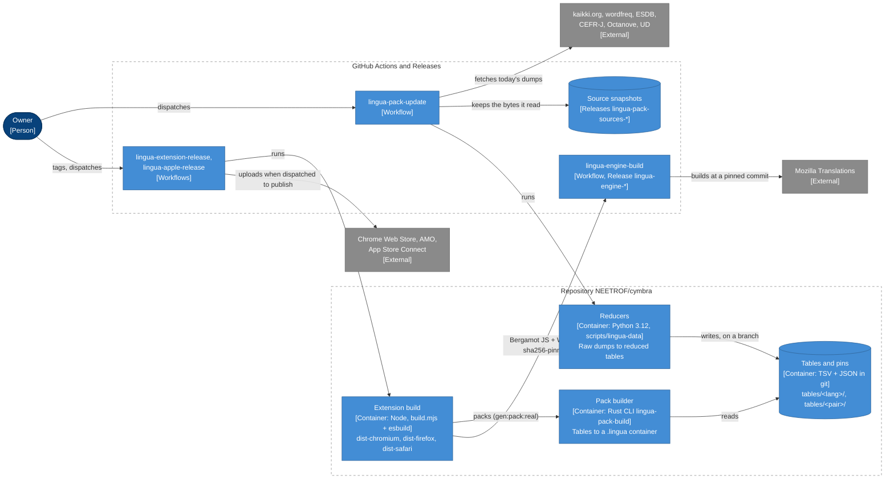

Four rules make this pipeline reproducible (`scripts/lingua-data/SOURCES.md:3-19`):

- **Raw sources are never committed; what is built from them is.** A pack is rebuilt from the
  committed tables, offline, in seconds, by every pull request and every release — and must match the
  sha256 recorded in that pair's `pin.json` (`scripts/lingua-data/build.sh:115-132`).
- **Only one workflow reads the internet for data.** `lingua-pack-update` fetches today's dumps,
  stores the exact bytes as a GitHub Release (`lingua-pack-sources-<pair>-<snapshot>`), reduces them,
  and pushes a branch; a person opens the pull request. A monthly cron runs it dry
  (`.github/workflows/lingua-pack-update.yml`).
- **Nothing the extension runs is downloaded at build time except the Bergamot engine**, which our
  own `lingua-engine-build` workflow compiled from a pinned `mozilla/translations` commit and which
  the build refuses unless its bytes match `engine-pin.json` (`build.mjs:105-125`). The Lingua WASM
  is built in each job with wasm-pack (`tool/gen_wasm.sh`), the packs with `lingua-pack-build`.
- **A release is not a deployment.** A `lingua-extension-v*` tag builds every variant and attaches
  the Chromium and Firefox zips to the GitHub Release; reaching a store is a separate dispatch with
  `publish` ticked (`apps/lingua-extension/README.md`, *Release*). The Safari build reaches readers
  only through `lingua-apple-release`.

The models follow a separate path: `lingua-model-deploy` (dispatch only) assembles the files named
in `model-manifest.json` from Mozilla's registry or our mirror releases (`lingua-model-*`), checks
both digests, and deploys them to Cloudflare Pages behind `models.cymbra.app`
(`.github/workflows/lingua-model-deploy.yml`, `apps/lingua-extension/tool/assemble_model_site.mjs`).

| Container | Responsibility | Where in the repo |
|---|---|---|
| Reducers | Turn raw dumps into the committed tables of one pair (glosses, expressions, senses) and of its studied language (forms, ranks, levels, readings, dictionary words) | `scripts/lingua-data/reduce-<pair>.py`, `reduce_common.py`, `reduce_edition_{en,fr,es}.py` |
| Source pinning | Fetch, record and verify raw sources; split tables per language; record the built pack's sha256 | `scripts/lingua-data/pack_sources.py` (`fetch-pinned`, `fetch-live`, `split`, `record-build`, `check-pack`) |
| Tables and pins | The reviewed, licensed input of every pack | `scripts/lingua-data/tables/{en,es}/`, `tables/{en-fr,es-fr,en-es,es-en}/`, each pair's `pin.json` and `manifest.json` |
| Pack builder | Assemble and size-check (5 MiB) a `.lingua` container | `crates/lingua-pack/src/bin/lingua-pack-build.rs:61` (`run`), `crates/lingua-pack/src/lib.rs:463` (`build_pack`) |
| Extension build | Bundle each variant, copy the shipped packs, the WASM, the engine and the model catalogue, write each manifest | `apps/lingua-extension/build.mjs`, `tool/gen_pack.sh`, `tool/gen_wasm.sh`, `tool/fetch_engine.sh`, `tool/manifests.mjs`, gate `tool/check_variants.mjs` |
| Pull-request gate | Rebuild every pair's pack against its pin, Rust baselines, extension lint and tests, re-reduce when the pipeline changes | `.github/workflows/lingua-extension-check.yml`, `.github/workflows/rust.yml` |
| Releases | Version from release-please (`lingua-extension`, `lingua-apple` components); build, attach, submit on dispatch | `.github/workflows/lingua-extension-release.yml`, `.github/workflows/lingua-apple-release.yml`, `release-please-config.json` |
| Engine build | Bergamot from a pinned commit, published as `lingua-engine-<commit>` | `.github/workflows/lingua-engine-build.yml`, `apps/lingua-extension/engine-pin.json`, `tool/build_engine.sh` |
| Model deploy | Mirror and host the pinned models | `.github/workflows/lingua-model-deploy.yml`, `tool/mirror_models.mjs`, `tool/check_model_host.mjs` |

## 3. Components (C3)

Four containers hold the interesting logic: the extension (drawn twice — reading and the reader's
data, then account, sync and translation), the engine crates, and the sync module. The Safari host
app and the Claude Code plugin are small enough for a table (§3.5). In §3.1 and §3.2, short paths
are under `apps/lingua-extension/src/`.

### 3.1 Browser extension — reading and the reader's data

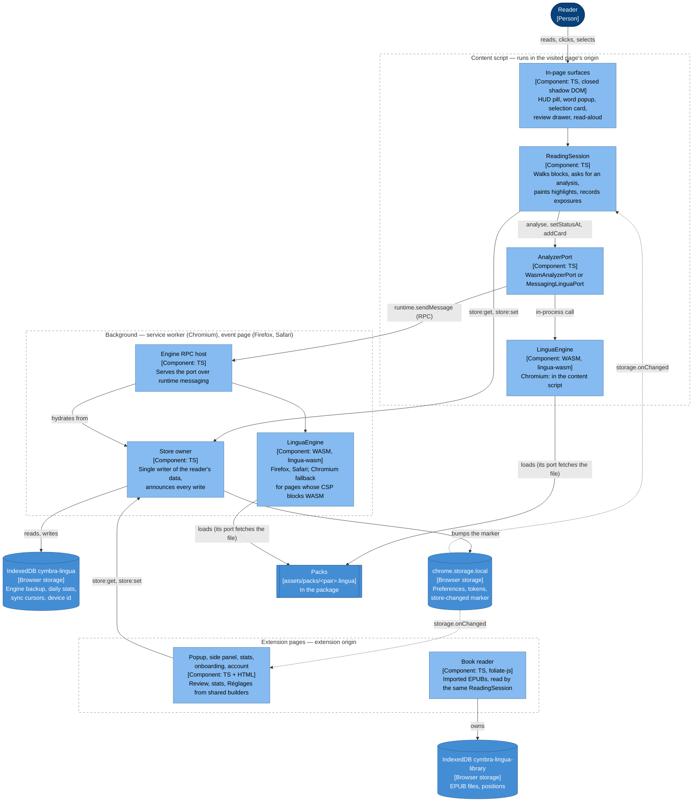

**One reading module, two hosts.** `ReadingSession` reads whatever document it is handed as a
`ReadingHost`: the visited page (from the content script) or each section of a book (from the
reader page, inside foliate-js's iframe). It walks the text blocks (`reading/blocks.ts`, which skips
code, form fields, our own UI and a video player's caption line), asks the engine for the whole
document's analysis, and paints with the **CSS Custom Highlight API** — two highlight registries,
zero DOM mutation (`reading/highlight.ts:233`, `render`). On long pages only the blocks within about
a viewport of the visible area are painted; a book section is painted whole. Dynamic pages are
re-scanned per mutated subtree (`reading/observer.ts`).

**The engine is behind a port.** Reading, review and statistics code never knows where the engine
runs: they call a `LinguaPort` (`analyzer/port.ts`). `resolveContentPort` picks the in-page WASM
engine on Chromium and falls back to the background's engine when the page's CSP forbids WASM;
Firefox and Safari always use the messaging port (`analyzer/create-port.ts:42`). Every engine starts
with the native language's default pair's pack and adds another pair's pack the first time a call
names its language (`analyzer/engine.ts:232-270`).

**The reader's data has one writer.** The background owns IndexedDB `cymbra-lingua`
(`state/store.ts:20`); every other context reads and writes it by message (`messagedArea`,
`state/store.ts:421`), because a content script cannot open the extension's database. After each
write the owner bumps a marker in `chrome.storage.local`, and every surface follows it through
`storage.onChanged` — the one channel that reaches content scripts and survives a suspended Safari
event page (`watchStore`, `watchBackup`, `state/store.ts:511-534`). That is how a word marked in one
tab repaints every other tab, the drawer and the side panel. Beside the backup, the owner records
the native language the reader last chose (`LAST_NATIVE_KEY`, `state/store.ts:97`) and refuses a
backup that names another one unless it comes with a reason — a change of native language or a
restore from a file — so a tab or a background that started before the change cannot undo it.

**One builder per view.** Review, statistics and Réglages are each built once — `mountReview`
(`review/review-page.ts:63`), `mountStats` (`stats/view.ts:198`), `mountSettings`
(`reading/settings-view.ts:193`) — and mounted into the side panel and the drawer, Réglages into the
popup too; a lint spec fails the build when a host of Réglages stops calling `mountSettings`
(`test/lint-settings-hosts.spec.ts`).

**Books stay in the reader page.** The EPUB library is a second IndexedDB database owned by the
reader page itself (`reader/library.ts`), because a 40 MB file must not cross a message. Reading
positions stay on the device; cards captured in a book keep « book · chapter » as their local source.

| Component | Responsibility | Where in the repo |
|---|---|---|
| Content-script entry | Injection guard, interface language, builds and starts the session | `apps/lingua-extension/src/content.ts:23` (`startSession`), `:43` (`bootstrap`) |
| ReadingSession | Analyse, paint, gestures, exposures, persist, follow external changes | `src/reading/session.ts:248`; `start` `:407`, `repaint` `:745`, `onGesture` `:940`, `flushExposure` `:992` |
| In-page surfaces | HUD, word popup, selection card, drawer, read-aloud | `src/reading/hud.ts`, `wordpopup.ts`, `selection-card.ts`, `drawer.ts`, `speech.ts` |
| Highlighting, blocks, observer | Text blocks, highlight registries, re-scan of mutated subtrees | `src/reading/blocks.ts`, `highlight.ts`, `observer.ts`, `scan.ts` |
| Exposure tracker | A block counts as read once visible past a dwell | `src/reading/exposure-tracker.ts:19` |
| AnalyzerPort | Where the engine runs, per variant and per page CSP | `src/analyzer/create-port.ts:29-50`, `engine.ts:176` (`WasmAnalyzerPort`), `messaging-port.ts:37`, `rpc-host.ts:24` |
| Pairs | Shipped pairs, default pair, reading language | `src/analyzer/pairs.ts:21` (`SHIPPED_PAIRS`), `:71` (`packPath`) |
| Store owner | IndexedDB owner, migration from `chrome.storage.local`, change marker | `src/state/store.ts`, wired in `src/background.ts` (store listener after `announceStoreChange`) |
| Storage helpers | Keys, backup load/save, engine hydration | `src/state/storage.ts:299` (`saveBackup`), `:472` (`hydrateEngine`) |
| Extension pages | Popup, side panel, stats page, onboarding, account page, book reader | `src/popup/`, `src/sidepanel/`, `src/stats/`, `src/onboarding/`, `src/account/`, `src/reader/` |
| Interface copy | One typed catalogue per language (fr is the source, en and es typed after it) | `src/i18n/README.md`, `src/i18n/{fr,en,es}/` |

### 3.2 Browser extension — account, sync and translation

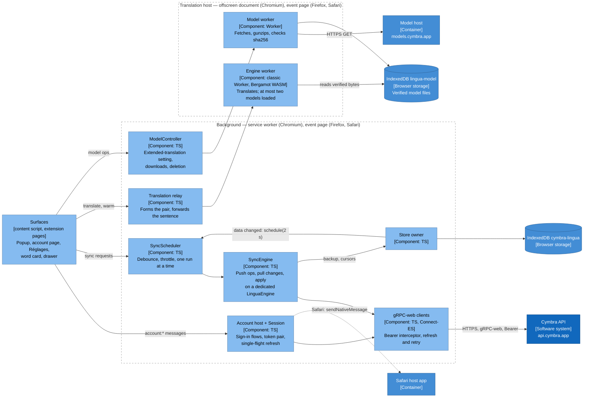

**Account.** The background owns the single session (`state/session.ts:67`). Sign-in is
email/password, Google or Apple; providers return an id_token that `AuthService.SignInOidc`
exchanges for a Cymbra token pair with the audience `lingua` (`session.ts:117`, `:143`). Both tokens
live in `chrome.storage.local`, the 15-minute access token with its expiry beside the 30-day refresh
token (`session.ts:12-24`). The transport attaches `Authorization: Bearer`, refreshes once on
`UNAUTHENTICATED` — concurrent failures share one refresh — and retries (`net/transport.ts:92`). It
never uses the site's cookie surface. Signing out never touches the reader's local data.

**Sync.** A second, dedicated `LinguaEngine` in the background does the merging, so the reading
engine is never disturbed (`background.ts:543`, `getSyncEngine`). Each run of `SyncEngine.sync`
(`sync/sync.ts:101`): read the account's erasure mark and the server's capabilities
(`GetDataState`); restore the stored backup into the sync engine; push statuses and declared levels
(`KnownWordsService.PushOps`, batches of 500), cards (`DeckService.PushCards`, without the page
address) and daily statistics (`StatsService.UpsertDailyStats`); pull what changed since the stored
cursors (`PullChanges`, `PullCards`); apply them last-write-wins in the engine; and, only if
something changed, save the merged backup — which every surface then follows. `SyncScheduler`
(`sync/scheduler.ts:31`) runs one exchange at a time: 2 s after a change, at most every 10 s when a
surface opens, every 60 s on page loads, and immediately on « Synchroniser maintenant ». A sync
request is answered only once the exchange is over, which is what keeps Safari's event page alive
meanwhile.

**Extended translation (« Traduction étendue »).** Off by default. Turning it on makes
`ModelController` (`translate/host/model-controller.ts:106`) download the models of the reader's
pairs' routes (es-fr goes through English: es-en, then en-fr). The model worker fetches each file
from `models.cymbra.app` with no cookie and no referrer, decompresses it, and keeps it only if its
sha256 is the one the package's catalogue pins (`translate/host/model-download.ts`). A translation
is relayed by the background (`translate/host/relay.ts:49`, `answerTranslation`) to the engine
worker, which runs in an offscreen document on Chromium (`translate/host/offscreen-engine.ts:61`)
and under the event page elsewhere; the worker is released ten minutes after the last translation
(`translate/port.ts:53`).

| Component | Responsibility | Where in the repo |
|---|---|---|
| Session | Token pair, every AuthService flow, refresh | `apps/lingua-extension/src/state/session.ts:67` |
| Account host | The one place surfaces reach the session and the account | `src/account/host.ts`, `src/account/profile.ts` (`UserService`) |
| Native sign-in (Safari) | Opens the host app, collects the handed id_token | `src/state/native-signin.ts`, wiring in `src/background.ts` (`__NATIVE_PROVIDERS__` branch) |
| gRPC-web clients | Connect-ES clients for auth, user and the four Lingua services | `src/net/transport.ts:92` (`createTransport`), `src/net/api.ts`; stubs generated by `tool/gen_proto.sh` |
| SyncEngine | Push, pull, apply, erasure check | `src/sync/sync.ts:74` |
| SyncScheduler | When an exchange runs | `src/sync/scheduler.ts:31` |
| Translation relay | Pair from document language + stored native language, forward, reconcile | `src/translate/host/relay.ts:49` |
| ModelController | The setting, which models, downloads, deletion, recovery | `src/translate/host/model-controller.ts:106` |
| Engine worker | Bergamot, routes, at most two resident models | `src/translate/host/engine-worker.ts`, `model-residency.ts` |
| Model download and store | Verified fetch, IndexedDB `lingua-model` | `src/translate/host/model-download.ts`, `model-db.ts:15` |
| Offscreen engine (Chromium) | Service worker's handle on the offscreen document | `src/translate/host/offscreen-engine.ts:61` |

### 3.3 The engine crates

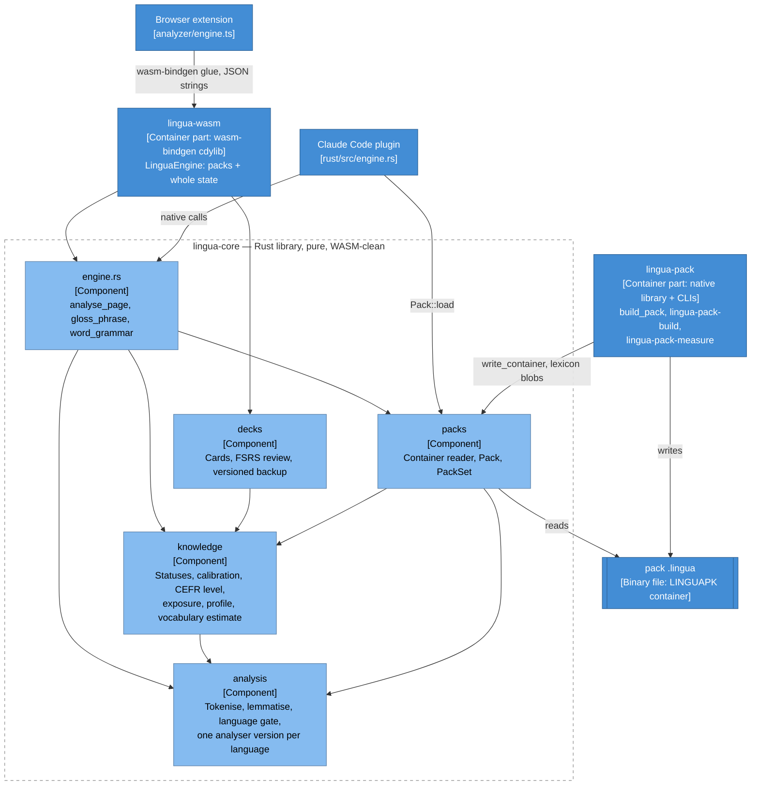

`lingua-core` is the deterministic heart: text → tokens → lemmas → classification against the
reader's knowledge → a known-token percentage, with no clock, no I/O and no unordered iteration in
any output, so the native and WASM builds produce the same bytes (`crates/lingua-core/src/lib.rs`,
`analysis/mod.rs`). Each studied language has its own analyser version — English `1.1.0`, Spanish
`1.2.0`, French `0.1.0` (`analysis/mod.rs:48-62`) — and a pack built for another generation of its
language is refused at load, so no partial analysis is ever produced (`packs/pack.rs:180`).

**How a token is classified.** A lemma with an explicit status is *known*, *learning* or *ignored*.
Without one, it is presumed known when the reader declared a CEFR level and the lemma's level is
strictly below it; with no declared level, when its frequency rank is within the calibration
threshold. Several candidate lemmas resolve in the reader's favour; an out-of-lexicon proper noun is
left out of the percentage (`knowledge/state.rs:479`, `classify`; `analysis/percent.rs:29`,
`TokenClass`). Exposure promotes a below-level lemma read on enough distinct days to
`Known(Exposure)` (`knowledge/state.rs:571`; the extension uses four days, `reading/session.ts:244`).

**`lingua-wasm`** is a thin binding with no logic of its own: `LinguaEngine` holds a `PackSet`, the
whole `LinguaState` and an optional review session, and every answer that depends on a language
takes it as an optional last parameter (`crates/lingua-wasm/src/lib.rs:14-31`, `:60`).
**`lingua-pack`** is native-only (it uses C zstd) and is the only writer of packs.

The **pack** is a single container (`packs/format.rs:35-37`: magic `LINGUAPK`, format version 1, a
JSON metadata block, then named sections): `forms` (an FST from form to lemma id), `lemmas`, `freq`,
`gloss.zst`, and optional `levels`, `expr` + `expr.zst` (expressions), `tags` + `paradigms.zst` +
`senses.zst` (word grammar), `lexical` (dictionary words) and `notice` (`packs/pack.rs:33-75`). An
optional section a core does not know is ignored, so adding one bumps `pack_version` and not the
analyser version (`openspec/specs/lingua-data-packs`).

| Component | Responsibility | Where in the repo |
|---|---|---|
| `engine.rs` | Page analysis, selection gloss, word grammar, canonical JSON | `crates/lingua-core/src/engine.rs:87` (`analyse_page`), `:366` (`gloss_phrase`), `:467` (`word_grammar`) |
| `analysis` | Tokeniser, lemma cascade, language detection and gates, percentage | `crates/lingua-core/src/analysis/` (`language.rs:36` `StudiedLanguage`, `pipeline.rs:64` `analyse_document`) |
| `knowledge` | Statuses with provenance, calibration, declared level, exposure, profile | `crates/lingua-core/src/knowledge/` (`state.rs:100` `KnowledgeState`, `status.rs:53` `Status`) |
| `decks` | Cards, FSRS-5, review session, backup schema v1–v3 | `crates/lingua-core/src/decks/` (`backup.rs:61` `LinguaState`, `review.rs:230` `ReviewSession`, `fsrs.rs:65` `FsrsParams`) |
| `packs` | Container format, pack reader, set of packs | `crates/lingua-core/src/packs/` (`format.rs:81,99`, `pack.rs:136` `Pack`, `set.rs:72` `PackSet`) |
| `lingua-wasm` | JS surface of the engine | `crates/lingua-wasm/src/lib.rs:60` (`LinguaEngine`), `:169` (`reprofileBackup`) |
| `lingua-pack` | Builder library and CLIs | `crates/lingua-pack/src/lib.rs:247` (`inputs_from_dirs`), `:463` (`build_pack`), `src/bin/` |

### 3.4 The Lingua sync module (server)

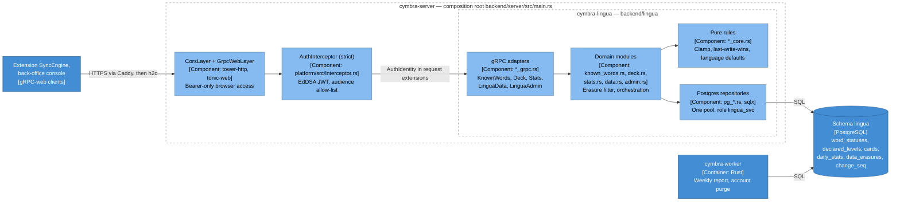

**Identity comes from the token only.** Every Lingua service is mounted behind the strict
`AuthInterceptor`, which verifies the bearer token and puts an `AuthIdentity` in the request; the
handlers take the user id from there, never from the request body (`backend/lingua/src/grpc_util.rs`,
`caller`). The admin RPCs additionally require the `admin` role in the `lingua` scope
(`backend/lingua/src/admin_grpc.rs`, `require_admin_in_scope`).

**Records, not blobs.** The server stores one row per (user, language, lemma) status, per declared
level, per card and per (day, language, device) statistic. A client timestamp in the future is
clamped to the server's clock; the later timestamp wins, and on a tie the greater device id
(`known_words_core.rs:14-33`, the same rule in SQL in `pg_known_words.rs`). Every write of a
status, a declared level or a card takes the next value of one sequence, `lingua.change_seq`, and a
pull returns the user's rows past the client's cursor. Daily statistics are replaced per device and summed across devices on read.

**Privacy and erasure.** Only lemma statuses, cards and day-grained aggregates cross the wire: the
card's page address is pushed empty and ignored (`deck.proto`, `openspec/specs/lingua-privacy`).
`EraseMyData` deletes the reader's Lingua rows and records an erasure mark; any push dated at or
before it is dropped, and a device whose store predates it empties itself before its next push
(`backend/lingua/src/data_core.rs`; on the client, `apps/lingua-extension/src/sync/sync.ts:185`,
`checkErasure`).

**Role from the pool.** The SQL in `pg_*.rs` names `lingua.*` tables; it runs on the pool built from
`CYMBRA_LINGUA_DATABASE_URL` (`backend/server/src/main.rs:794`), whose user is `lingua_svc`, owner
of the `lingua` schema with `search_path = lingua` (`backend/db/init/roles.sql.tpl:111-125`). The
module also runs its own migrations on that pool at start-up.

| Component | Responsibility | Where in the repo |
|---|---|---|
| gRPC adapters | Map protobuf to domain calls | `backend/lingua/src/known_words_grpc.rs:60`, `deck_grpc.rs:75`, `stats_grpc.rs:60`, `data_grpc.rs:35`, `admin_grpc.rs:56` |
| Contracts | The external contract, gated by `buf breaking` | `backend/lingua/proto/known_words.proto:17-26`, `deck.proto:21-24`, `stats.proto:17-23`, `lingua_data.proto:14-21`, `lingua_admin.proto:21-26` |
| Domain modules | Orchestration, erasure filtering | `backend/lingua/src/known_words.rs:96`, `deck.rs:75`, `stats.rs`, `data.rs:20` (`ErasureMarks`), `admin.rs` |
| Pure rules | Clamp, LWW, language normalisation | `backend/lingua/src/known_words_core.rs:14,21`, `stats_core.rs`, `data_core.rs`, `language_core.rs` |
| Repositories | sqlx queries on the `lingua` schema | `backend/lingua/src/pg_known_words.rs`, `pg_deck.rs`, `pg_stats.rs`, `pg_data.rs`, `pg_admin.rs` |
| Migrations | Tables and their evolution | `backend/lingua/migrations/0001`–`0006` |
| Interceptor, CORS | Token check, gRPC-web for browser origins | `backend/platform/src/interceptor.rs:18`, `backend/server/src/main.rs:147` (`strict`), `:858-879` (CORS, `GrpcWebLayer`) |

### 3.5 The two small containers

**Safari host app** (`apps/lingua-apple`, bundle ids `com.cymbra.lingua` and
`com.cymbra.lingua.Extension`; iOS 17.2 and macOS 12 at least, since highlighting needs the CSS
Custom Highlight API, which Safari ships from 17.2):

| Component | Responsibility | Where in the repo |
|---|---|---|
| Copy phase | Copies `apps/lingua-extension/dist-safari/` into each `.appex` at build time; refuses a manifest still pointing at a local backend for device builds | `apps/lingua-apple/Cymbra Lingua.xcodeproj/project.pbxproj` (*Copy Lingua extension*), `README.md` |
| Activation page | Steps (iOS) or the real extension state (macOS), in the interface language | `apps/lingua-apple/Shared (App)/ViewController.swift`, `Shared (App)/Resources/` |
| Sign-in sheet | Opened by `cymbra-lingua://signin?provider=…&lang=…`; Apple's native button, Google through `ASWebAuthenticationSession` with PKCE | `Shared (App)/SignInView.swift`, `Shared (App)/GoogleWebSignIn.swift`, `LinguaSignIn/Sources/LinguaSignIn/SignInFlow.swift`, `GoogleOAuth.swift` |
| id_token hand-off | Leaves the id_token in the App Group, taken once within five minutes | `LinguaSignIn/Sources/LinguaSignIn/IdTokenHandoff.swift` |
| Native handler | Answers `auth.providers`, `auth.takeIdToken`, `interface.language` | `Shared (Extension)/SafariWebExtensionHandler.swift`, `LinguaSignIn/Sources/LinguaSignIn/NativeMessage.swift` |

**Claude Code plugin** (`apps/lingua-agent`):

| Component | Responsibility | Where in the repo |
|---|---|---|
| Plugin manifest, hook, MCP config, `/vocab` | What Claude Code loads | `.claude-plugin/plugin.json`, `hooks/hooks.json` (`Stop` → `lingua ingest`), `.mcp.json` (`lingua mcp`), `commands/vocab.md` |
| `lingua` binary | Subcommands `ingest`, `statusline`, `vocab`, `mcp` | `rust/src/main.rs:71-86` |
| Ingest | Reads the assistant text of a transcript, idempotent on byte offset, records exposures; stores no sentence | `rust/src/ingest.rs`, `rust/src/source.rs` |
| Engine library | Packs installed in `~/.lingua/*.lingua`, language detection, `analyse_page` | `rust/src/engine.rs:71` (`Library`), `:245` (`analyse`) |
| MCP server | JSON-RPC over stdio; `list_decks`, `add_words`, `due_cards`, `answer_card` (FSRS) | `rust/src/mcp.rs:51-63`, `:99-192` |
| Store | SQLite `~/.lingua/lingua.db` (schema v2) | `rust/src/store.rs:92` |

## 4. Code (C4): the engine's core types

Two class diagrams of `lingua-core` and `lingua-wasm`, drawn from the Rust source: what an engine
holds and how it answers a page, then the reader's state it persists. Fields and methods are a
selection; private fields are marked `-`.

### 4.1 The engine, its packs and a page's analysis

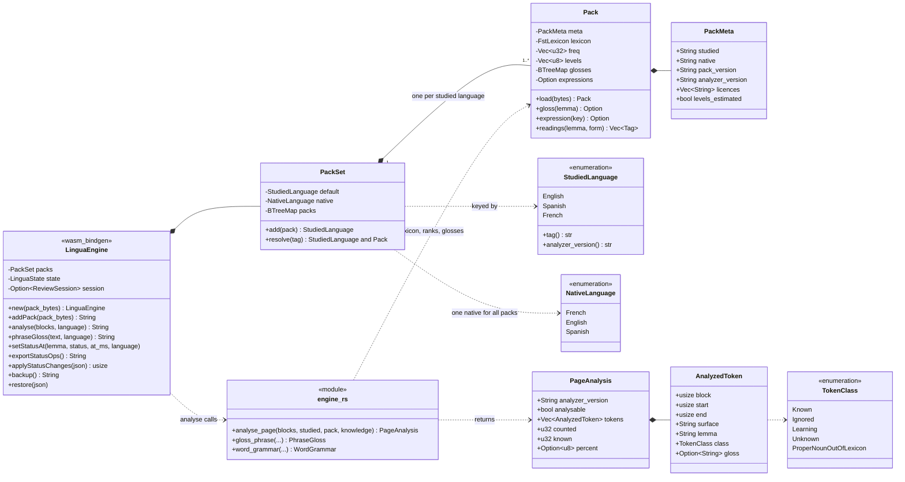

An engine is created from one pack — the default pair of the reader's native language — and gains
another studied language's pack the first time a call names it; a pack glossed in another native
language, or a second pack for a language already held, is refused (`PackSet::add`,
`crates/lingua-core/src/packs/set.rs:96`). `analyse` resolves the language, runs `analyse_page` on
that pack and the reader's knowledge, and returns its canonical JSON — the string the browser reads.
`Pack` also implements the two traits the knowledge model classifies with, `FrequencyRanks` and
`CefrLevels` (`packs/pack.rs:478-488`).

### 4.2 The reader's state

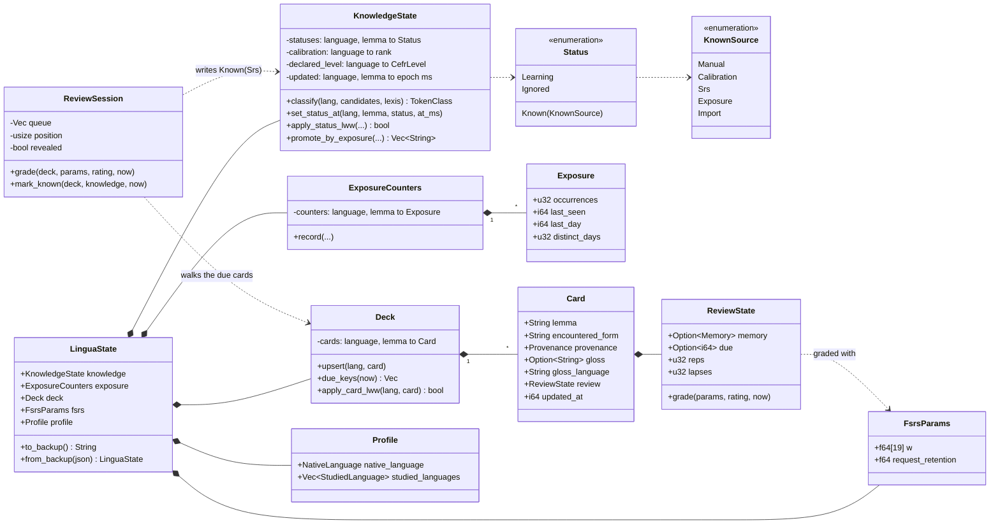

`LinguaState` is the whole of a reader's local data, and its backup is the string the extension
stores and the file « Sauvegarder » downloads (`decks/backup.rs:61`). Every map is keyed by
`StudiedLanguage` first and is an ordered `BTreeMap`, so a serialised state is deterministic. The
backup carries a schema version: 1 for an English-only reader of the default profile, 2 for any other
state, 3 once French is a studied language — written only then, so a build that predates French
refuses such a file by name instead of misreading it (`backup.rs:24-57`). The reader's `Profile` is
in the backup and is never synced. The `updated` timestamps are what make sync work: a status
cleared by the reader keeps its timestamp as a tombstone, so a stale re-add from another device
cannot win (`knowledge/state.rs:100-138`).

| Type | Where in the repo |
|---|---|
| `LinguaEngine` | `crates/lingua-wasm/src/lib.rs:60` (constructor `:185`, `analyse` `:819`, `backup` `:1116`, `restore` `:1122`) |
| `PackSet`, `Pack`, `PackMeta` | `crates/lingua-core/src/packs/set.rs:72`, `packs/pack.rs:136` (`load` `:180`), `packs/meta.rs:21` |
| `StudiedLanguage`, `NativeLanguage`, `Profile`, `LanguagePair` | `crates/lingua-core/src/analysis/language.rs:36`, `knowledge/profile.rs:36`, `:127`, `:81` |
| `analyse_page`, `PageAnalysis`, `AnalyzedToken`, `TokenClass` | `crates/lingua-core/src/engine.rs:87`, `:70`, `:50`, `analysis/percent.rs:29` |
| `LinguaState`, `BACKUP_SCHEMA_VERSION` | `crates/lingua-core/src/decks/backup.rs:61`, `:57` |
| `KnowledgeState`, `Status`, `KnownSource` | `crates/lingua-core/src/knowledge/state.rs:100`, `knowledge/status.rs:53`, `:24` |
| `ExposureCounters`, `Exposure` | `crates/lingua-core/src/knowledge/exposure.rs:62`, `:33` |
| `Deck`, `ReviewSession`, `Card`, `ReviewState`, `FsrsParams` | `crates/lingua-core/src/decks/review.rs:38`, `:230`, `decks/card.rs:89`, `decks/fsrs.rs:170`, `:65` |

## 5. Dynamic views

### 5.1 Reading a web page

Chromium, with the reader injected and nothing marked yet on this page. On Firefox and Safari the
same calls go from the content script to the event page's engine over runtime messaging (§2.2).

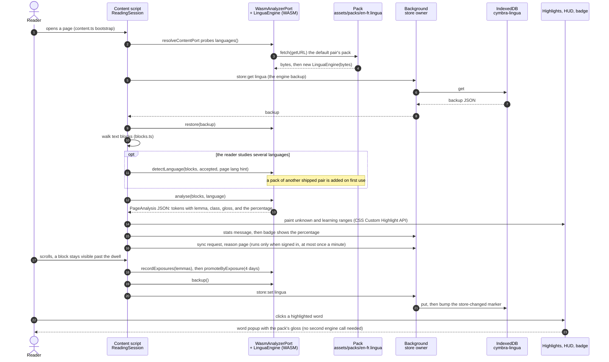

What to notice:

- **Nothing leaves the device.** The pack is a file inside the package, fetched by
  `chrome.runtime.getURL` (`analyzer/engine.ts:172`); the analysis is the engine's; the store is
  local. The only outbound request in this flow is the sync request, and it does nothing while
  signed out (`sync/scheduler.ts`, `schedule`).
- **The gloss comes with the analysis.** `analyse_page` attaches the native-language gloss to every
  *unknown* or *learning* token, so the popup opens without another call
  (`crates/lingua-core/src/engine.rs:134-139`). A selection of several words goes through
  `phraseGloss` instead, which also matches the pack's expressions (`reading/selection-card.ts`).
- **A page is not analysable** when it holds too little of a studied language (blocks under 12 bytes
  are left out, and a document with fewer than 10 counted tokens is not analysable — `analysis/language.rs:96-101`); the badge then
  shows « — » rather than a misleading percentage.
- **Exposure is conservative.** A block counts once, only after it has been visible for a dwell
  (`reading/exposure-tracker.ts`), and a presumed-known lemma is confirmed only after reading on
  several distinct days.

### 5.2 Marking a word and syncing it

The reader is signed in. They mark a word « Je connais » in the popup; the change reaches the
server, and from there their other devices.

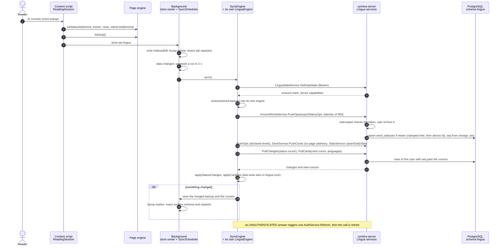

What to notice:

- **The page engine and the sync engine are two instances** of the same WASM module in different
  contexts; they meet only through the stored backup. The merge is therefore a plain
  restore → apply → backup (`sync/sync.ts:1-30`).
- **The trigger is the owner's write**, not a timer in the page: the store owner calls
  `onReaderDataChanged` after every write (`background.ts`, `announceStoreChange`), and the page also
  asks for a sync after persisting, because a suspended Safari event page loses its timers
  (`reading/session.ts:700-713`).
- **What the server keeps**: one row per (user, language, lemma) in `lingua.word_statuses`, with its
  status, provenance, winning timestamp, device id and sequence number
  (`backend/lingua/migrations/0001_lingua.sql`). A first sign-in is not special: it is a large push.
- **Signing in** happened earlier, in the background: email and password, or an id_token from Google
  or Apple (through the host app on Safari), exchanged by `AuthService.SignInLocal` or `SignInOidc`
  for a token pair with the audience `lingua` (`state/session.ts:117`, `:143`).

### 5.3 Building and shipping a pack

From today's Wiktionary dump to a pack inside an installed extension. Most runs skip the first half:
a pull request that does not touch the data only rebuilds the packs from the committed tables.

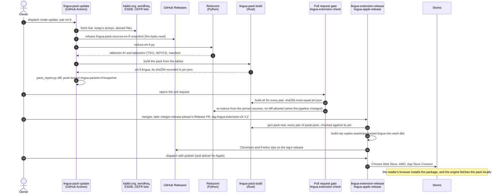

What to notice:

- **Two kinds of tables.** A studied language's own tables (forms, ranks, CEFR levels, readings,
  dictionary words, tag pool) live once in `tables/<lang>/` and are written by that language's
  reference pair; a pair's tables (glosses, expressions, senses) in `tables/<pair>/`
  (`scripts/lingua-data/tables/en-fr/README.md`).
- **The pin is the lockfile.** `pin.json` records the snapshot, the reducer's own hash, every
  source's URL and sha256 (kaikki's bytes as a release asset), and the sha256 and size of the pack
  the tables build (`scripts/lingua-data/pack_sources.py:9-32`). `crates/lingua-pack/tests/committed_tables.rs`
  holds the shipped packs to their pins in `cargo test` too.
- **Which pairs ship** is decided by `apps/lingua-extension/packs.json`, and nothing else; tables can
  exist for pairs that do not ship yet (`en-es`, `es-en` today). `tool/check_variants.mjs` refuses a
  package whose packs differ from the list.
- **The pull-request build uses test packs.** `lingua-extension-check` builds the extension with the
  tiny testdata packs (`yarn gen:pack`) and builds the real ones separately against their pins;
  the release builds with the real packs (`yarn gen:pack:real`).

### 5.4 A translation request

The reader turned on « Traduction étendue » in Réglages, studies Spanish, and selects a sentence on
a Spanish page. Chromium shown; on Firefox and Safari the event page plays the offscreen document's
part.

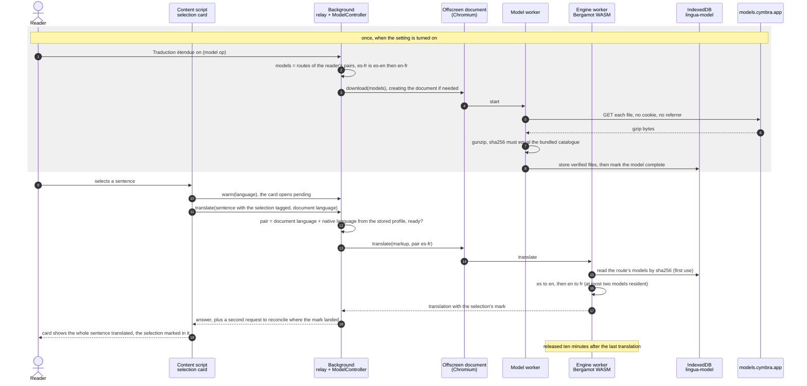

What to notice:

- **The engine ships, the model does not.** The Bergamot JS and WASM are inside the package, built
  by our CI from a pinned commit and checked against `engine-pin.json`; only the model — data — is
  downloaded, and only after the reader asks (`apps/lingua-extension/TRANSLATION.md`).
- **The host serves bytes, the package decides.** The model catalogue bundled in the package pins
  every file's sha256; a file is stored only if it matches, which also defeats the static host's
  "unknown path answers the home page" trap (`translate/host/model-download.ts`).
- **The translation never runs on a thread that paints**: an offscreen document on Chromium (a
  service worker cannot construct a `Worker`), the event page's worker elsewhere
  (`build.mjs:110-114`).
- **A pivot costs two models.** Mozilla publishes no Spanish → French model, so es-fr routes through
  English (`model-manifest.json`, `routes`).

## 6. Where data lives

| Where | What | Written by | Leaves the device? | Where in the repo |
|---|---|---|---|---|
| **Extension package** | The packs of `packs.json`, the Lingua WASM, the Bergamot engine, the model catalogue, the interface copy | the build | it *is* what is installed | `build.mjs:186-206` (`staticCopies`), `:288-295` |
| **IndexedDB `cymbra-lingua`** (extension origin) | The engine backup under `lingua` (statuses, deck, exposures, FSRS parameters, profile), daily statistics, device id, status and card cursors, the last erasure mark seen, the native language last chosen | the background only (store owner) | the records in it, when signed in and synced | `src/state/store.ts:20-36` |
| **`chrome.storage.local`** | Preferences (highlighting on/off, HUD, colours, voices, reader display, interface language), the token pair, last sync time, session-lost mark, the store-changed marker, the extended-translation setting and model state | the background and surfaces | no | `src/state/storage.ts`, `src/state/session.ts:23-24`, `src/translate/setting.ts:18-19` |
| **`chrome.storage.session`** | Transient UI state: which panel view to open, a sign-in error to show, an email awaiting its code | background, account page | no | `src/background.ts:145`, `src/state/session.ts:33`, `src/account/account.ts:31` |
| **IndexedDB `cymbra-lingua-library`** (reader page) | Imported EPUB files keyed by SHA-256, reading positions | the reader page | never | `src/reader/library.ts` |
| **IndexedDB `lingua-model`** | Verified, decompressed model files | the model worker | never (downloaded into it) | `src/translate/host/model-db.ts:15` |
| **Safari App Group** | A handed id_token (taken once, within five minutes), the interface language | host app, native handler | no | `apps/lingua-apple/LinguaSignIn/Sources/LinguaSignIn/IdTokenHandoff.swift`, `SignInLanguage.swift` |
| **`~/.lingua/`** (Claude Code plugin) | `lingua.db` (SQLite: exposures, statuses, cards, ingest offsets) and the installed packs | the `lingua` binary | never | `apps/lingua-agent/rust/src/store.rs`, `rust/src/engine.rs:34-48` |
| **PostgreSQL schema `lingua`** | `word_statuses`, `declared_levels`, `cards` (no page address), `daily_stats` (per day, language, device), `data_erasures`, sequence `change_seq` | the sync module, as `lingua_svc` | — | `backend/lingua/migrations/` |
| **Cymbra ID schemas** | Account, linked identities, sessions (each bound to an audience, `lingua` here), the record that the account uses Lingua | Cymbra ID | — | `backend/auth/migrations/0002_sessions.sql`, `backend/user/migrations/0011_account_apps.sql` |
| **Git** | Reduced tables, pins, manifests, NOTICEs, test data, `packs.json`, `model-manifest.json`, `engine-pin.json` | pull requests (tables: `lingua-pack-update` branches) | public | `scripts/lingua-data/tables/`, `scripts/lingua-data/testdata/`, `apps/lingua-extension/*.json` |
| **GitHub Releases** | Raw source snapshots (`lingua-pack-sources-<pair>-<snapshot>`), the Bergamot build (`lingua-engine-<commit>`), the model mirror (`lingua-model-<from>-<to>-<model>-<version>`), extension zips (`lingua-extension-v*`) | workflows | public | `pack_sources.py:479-484`, `tool/engine_pin.mjs`, `model-manifest.json` (`mirror`) |
| **Cloudflare Pages** | `models.cymbra.app` (model files), `cymbra.app` (the site, with the Lingua pages) | `lingua-model-deploy`, `site-deploy` | public | `.github/workflows/lingua-model-deploy.yml`, `.github/workflows/site-deploy.yml` |

Never stored anywhere but the device: the text of a page or a book, a page's address, reading history,
EPUB files, and the plugin's transcripts (`openspec/specs/lingua-privacy`,
`openspec/specs/lingua-agent-capture`). Never committed: raw dumps and built packs
(`scripts/lingua-data/.gitignore`).

## 7. Deployment

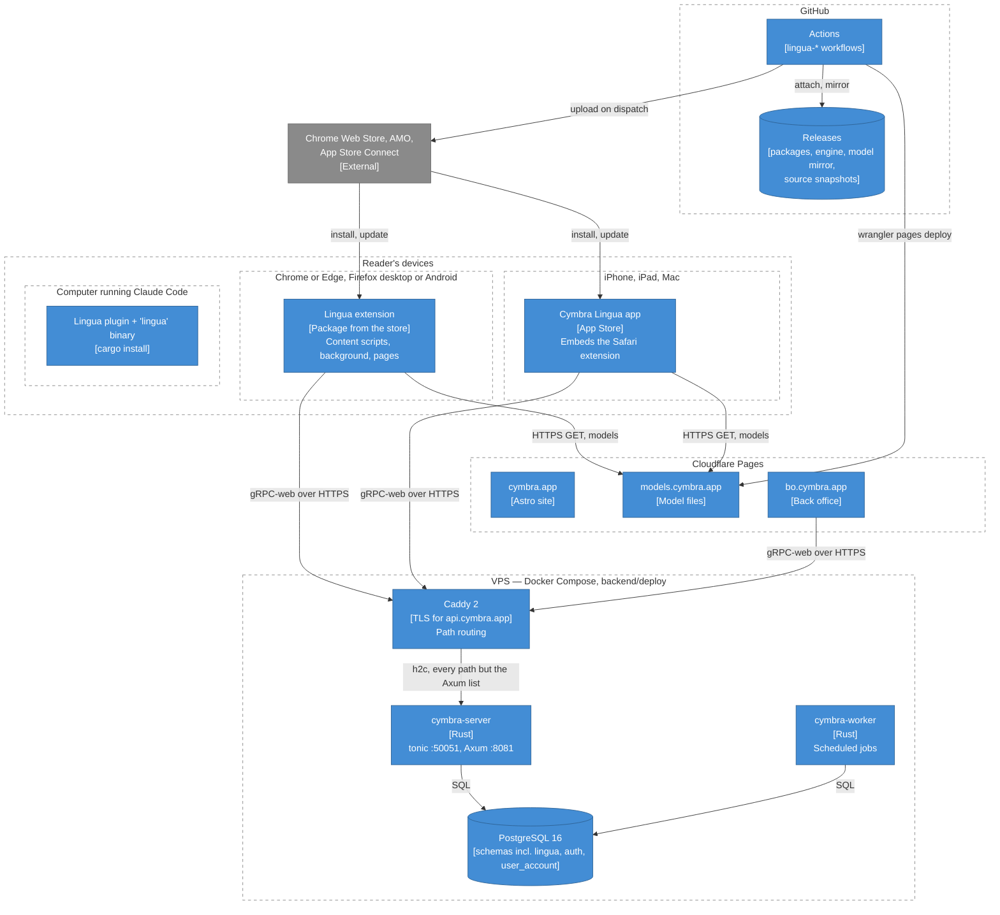

- **One VPS** runs Postgres, Valkey, `cymbra-server`, `cymbra-worker` and Caddy from one image
  (`backend/deploy/docker-compose.prod.yml`, `backend/Dockerfile`). Lingua adds no container: its
  services are mounted in `cymbra-server` when `CYMBRA_LINGUA_DATABASE_URL` is set, and its schema
  and role are provisioned on the existing Postgres (`backend/deploy/provision-lingua-role.sql`).
- **Caddy routes by path**, not by protocol: a short list goes to Axum (`/.well-known/*`, `/healthz`,
  `/readyz`, `/web/*`, …) and everything else — including `/cymbra.lingua.v1.*` and the browser's
  CORS preflight — to tonic over h2c (`backend/deploy/Caddyfile`). Lingua has no route of its own.
- **Browser access is bearer-only.** tonic accepts gRPC-web over HTTP/1.1 behind a CORS layer whose
  origins are the back office's plus `CYMBRA_ALLOWED_WEB_ORIGINS`, where the extension's
  `chrome-extension://<id>` origin is listed (`backend/server/src/main.rs:858-879`). The extension
  is built with `LINGUA_GRPC_WEB_URL=https://api.cymbra.app` for releases (`apps/lingua-extension/README.md`).
- **Static hosting** on Cloudflare Pages serves the site, the back office and the model files; each
  is deployed by its own workflow on dispatch (the site and the back office also through `deploy.yml`).
- **Everything a reader needs to read is on the device**: if the VPS is down, reading, marking,
  reviewing and statistics keep working; only sync and sign-in wait.

## 8. Glossary

| Term | Meaning |
|---|---|
| **Studied language** | A language the reader learns: `en`, `es`, or `fr` in the engine (`StudiedLanguage`). |
| **Native language** | The language glosses are written in, and the interface language: `fr`, `en` or `es` (`NativeLanguage`). One per engine. |
| **Pair** | `<studied>-<native>`, e.g. `en-fr`: the unit a pack, a translation route and a coverage figure are keyed by. |
| **Profile** | The reader's native language and studied languages, primary first. Stored in the backup, never synced. |
| **Pack** | A `.lingua` file for one pair: forms → lemmas, ranks, glosses, optional levels, expressions, word grammar, dictionary words, NOTICE. Built from committed tables, shipped inside the package. |
| **Tables** | The reduced, committed TSV inputs of packs: `tables/<lang>/` for the studied language, `tables/<pair>/` for the pair. |
| **Pin** | `pin.json`: which raw sources, reducer and snapshot a pair's tables came from, and the sha256 of the pack they build. |
| **Reducer** | The Python script that turns raw dumps into tables for one pair. |
| **Snapshot** | The date of the raw sources a pin records; part of `pack_version`. |
| **Lemma** | The dictionary form a token resolves to (`ran` → `run`). Knowledge, cards and sync are keyed by (language, lemma). |
| **Form** | A word as written on the page; the pack's FST maps lower-cased forms to lemma ids. |
| **Gloss** | A short native-language meaning of a lemma or expression, from Wiktionary data — never a machine translation. |
| **Expression** | A multi-word entry of the pack (`give up`), matched over dictionary forms, up to five tokens. |
| **Readings / word grammar** | What a form can be (dictionary form + Universal Dependencies tag) and the senses by part of speech, shown on the word card. |
| **Status** | What the reader said of a lemma: *learning*, *known* (with its provenance) or *ignored*. No status means *new*. A withdrawn status is *cleared* on the wire. |
| **Provenance** | Why a lemma is known: `Manual`, `Calibration` (implicit, never stored), `Srs`, `Exposure`, `Import`. |
| **Calibration** | A frequency-rank threshold under which an unmarked lemma counts as known; used when no level is declared. |
| **Declared level** | The CEFR level (A1–C2, or « débutant ») the reader chose; unmarked lemmas below it count as known. Some packs' levels are estimated from frequency. |
| **Exposure** | One more reading of a lemma, counted when its block stayed visible; distinct days can promote a below-level lemma to `Known(Exposure)`. |
| **Coverage, percentage** | The share of counted tokens on a page that are known or ignored; out-of-lexicon proper nouns are not counted. The site's *coverage* is a different figure: the glossed share of the commonest words in a pack. |
| **Analysable** | Whether a page holds enough studied-language text to be scored at all. |
| **Analyser version** | Per-language version of the analysis rules; a pack names the one it was built for and is refused by any other. |
| **Card, deck** | A card is a learning lemma or expression with its sentence, gloss and FSRS state; the deck is all of them, per language. |
| **Review, due** | Spaced repetition with FSRS-5: each grade (*again*, *hard*, *good*, *easy*) sets when the card is due again. |
| **Backup** | The serialised `LinguaState`: the reader's whole local data, schema version 1–3, the same string the extension stores. |
| **Reading session, host** | The reading module (`ReadingSession`) and the document it reads (`ReadingHost`): a web page or a book section. |
| **HUD, word popup, selection card, drawer, side panel** | In-page pill with the percentage; the card a highlighted word opens; the card a selection opens; the in-page review/stats/settings panel; Chromium's native panel. |
| **Réglages** | The settings view, one builder mounted in the drawer, side panel and popup. |
| **Store owner, marker** | The background, sole writer of IndexedDB `cymbra-lingua`; the key it bumps in `chrome.storage.local` after each write. |
| **Op, cursor, LWW** | A record pushed to the server; the server sequence number a device has pulled up to; last-write-wins by timestamp, then device id. |
| **Erasure mark** | The time of the reader's « Effacer mes données Lingua »; older pushes are dropped and older devices empty themselves. |
| **Extended translation** | « Traduction étendue »: an opt-in, per-device sentence translation with Bergamot, its model downloaded once. |
| **Route, pivot** | The models a pair's translation goes through; `es-fr` pivots through English (`es-en`, then `en-fr`). |
| **Engine** | Two different things: the **Lingua engine** (`lingua-core`, as WASM `LinguaEngine`) that analyses text, and the **translation engine** (Bergamot) that translates sentences. |
| **Variant, target** | One of the three extension builds: `chromium`, `firefox`, `safari`. |

## 9. Open points

What this document found inconsistent between code, specs and docs, or could not settle. The code
is described above as it is; these are for whoever touches the files next.

1. **Extension README, state.** *How it works → State* and *Review → State authority* say the
   reader's state lives in `chrome.storage.local`; it moved to IndexedDB, owned by the background
   (`src/state/store.ts`, change `move-lingua-store-to-indexeddb`). *Account sync* says the access
   token lives in `chrome.storage.session`; both tokens are in `chrome.storage.local`
   (`src/state/session.ts:12-24`), and the `SessionDeps.sessionArea` comment still says otherwise.
2. **A declared kill switch nobody reads.** The flag registry declares `lingua.sync.enabled`, "flip
   off to disable push/pull for all signed-in devices" (`backend/feature-flags/src/registry.rs:793-801`);
   no code in the server, the Lingua crate or any client reads it.
3. **YouTube captions are not shipped.** `openspec/changes/add-lingua-youtube-captions` is a
   proposal with no task done. What exists is that the page reader skips a video player's caption
   line (`src/reading/blocks.ts:11-17`).
4. **Shipped changes not yet archived.** The EPUB reader (`add-lingua-reader`), read-aloud
   (`add-lingua-read-aloud`) and the server side of native-language labels
   (`add-lingua-native-language-server`) are in the code, but their changes are still under
   `openspec/changes/`, so `openspec/specs/` does not describe them yet.
5. **`lingua-sync` spec vs code.** The spec says the change adds no role and no scope; the admin
   console later added the `lingua` scope (`backend/platform/src/lib.rs:47`). It describes an
   injected `UserPort`; the crate depends on `cymbra-user-port` but never uses it, and
   `backend/server/src/main.rs:788` says "no UserPort here". It expects flag evaluation and usage
   events for the `lingua` audience; the extension generates no flags or usage clients
   (`tool/gen_proto.sh:45`). `KnownWordsService.GetSnapshot` has no caller in the extension.
6. **Stale comments found on the way:** `apps/back-office/src/router.ts:51` (a pack registry that was
   removed), `apps/lingua-extension/src/analyzer/port.ts:16-18` (Safari analysis over native
   messaging — it uses the event page), `scripts/lingua-data/SOURCES.md:134-136` and
   `apps/lingua-extension/REVIEWERS.md:58-60` (es-fr described as not shipped, or en-fr as the only
   pack), `.github/workflows/lingua-apple-release.yml:17-18` (an EN→FR pack "cached between runs"; it
   builds every pack, uncached), several comments that leave Safari out of the packages carrying the
   translation engine (`lingua-engine-build.yml:4-5`, `tool/fetch_engine.sh:2`,
   `lingua-model-deploy.yml:5`, `TRANSLATION.md:21`), `apps/lingua-apple/Shared (App)/SignInView.swift:6-8`
   (Google "not wired yet"; it is), `backend/lingua/migrations/0001_lingua.sql:16` (`change_seq` called
   per-user; it is one global sequence, so a user's cursor advances with gaps).
7. **Deployment docs and the worker.** `backend/deploy/DEPLOY.md`, `provision-lingua-role.sql` and
   `.env.prod.example` say the worker needs `CYMBRA_LINGUA_DATABASE_URL` for the account purge; the
   purge runs on the `admin_svc` pool, and the worker reads the Lingua URL only for its Discord report
   (`backend/worker/src/config.rs:70-74`).
8. **Unverified claim.** The plugin's README calls "no network connection" a tested invariant; no test
   under `apps/lingua-agent/rust/tests/` asserts it. It holds by construction today: the binary's
   only dependencies are `lingua-core`, `rusqlite` and `serde`.

## 10. Further reading

- [Language matrix programme](language-matrix-programme.md) and [Spanish programme](spanish-programme.md) — the decisions behind the languages, and what is in flight.
- [Extension README](../../apps/lingua-extension/README.md), [TRANSLATION.md](../../apps/lingua-extension/TRANSLATION.md), [REVIEWERS.md](../../apps/lingua-extension/REVIEWERS.md) — the extension in detail, the translation engine, the store reviewers' guide.
- [Browser-extension architecture skill](../../.claude/skills/browser-extension-architecture/SKILL.md) — the platform truths behind §2.2 and §3.1.
- [Safari host app README](../../apps/lingua-apple/README.md), [Claude Code plugin README](../../apps/lingua-agent/README.md).
- [Data sources](../../scripts/lingua-data/SOURCES.md) and [the en-fr tables](../../scripts/lingua-data/tables/en-fr/README.md) — where every table comes from, and its licence.
- Specs: `openspec/specs/lingua-analysis`, `lingua-knowledge-model`, `lingua-decks-review`, `lingua-data-packs`, `lingua-browser-extension`, `lingua-sync`, `lingua-privacy`, `lingua-stats`, `lingua-translation`, `lingua-apple-app`, `lingua-agent-capture`, `admin-lingua-console`, `site-lingua-page`.
- [Backend deployment](../../backend/deploy/DEPLOY.md) and the root [CLAUDE.md](../../CLAUDE.md) section on reading database privileges.
