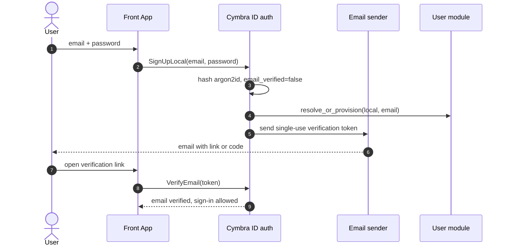
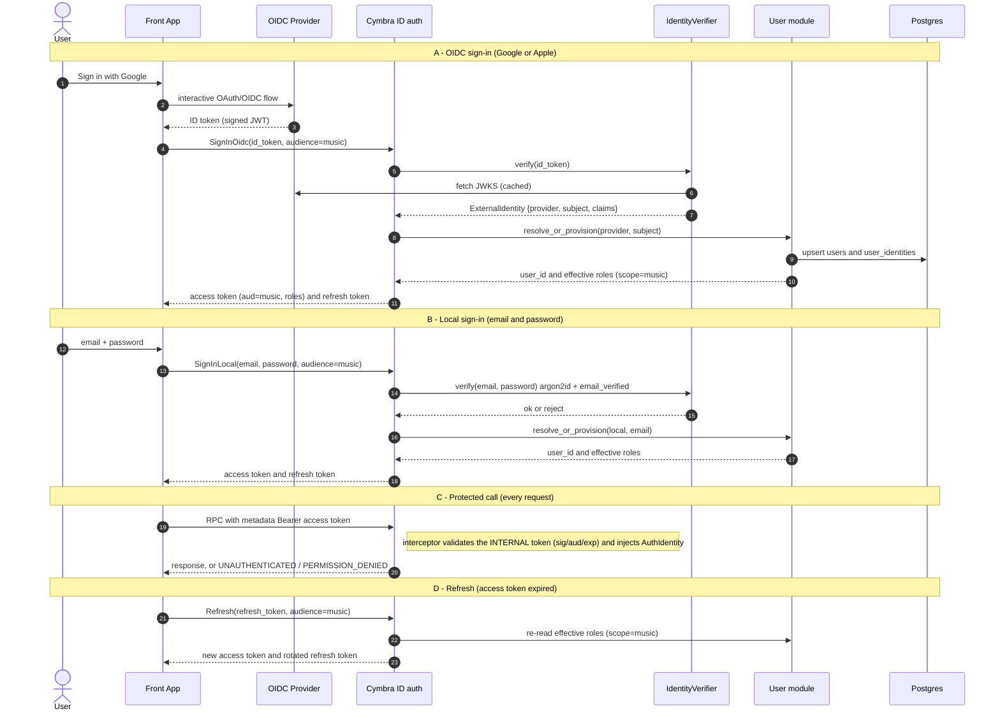

## Context

Cymbra today is a local-only product: a Flutter client driving an on-device Rust
engine (MIDI, MusicXML, audio) in a Cargo + Melos monorepo. There is no server.

**Product picture.** Cymbra is becoming **two apps that share users**: *Cymbra
Music* (existing) and *Cymbra Live* (RTC audio/video channel streaming). This
change builds **Cymbra ID** — the shared identity/account hub both apps consume.
Cymbra ID owns identity, accounts, and **product-level (scoped) roles**, and
issues **audience-scoped tokens**. The product backends (Music, Live) and Live's
RTC/media service are **separate** services that trust Cymbra ID tokens and key
their **own** domain data + fine-grained authorization on the shared `user_id`.
Cymbra ID deliberately does *not* centralize every app's domain ACLs — that would
couple it to each product; it centralizes identity + coarse, durable product roles
(and, later, entitlements).

**Standalone mode.** Each app also offers a fully **standalone, no-account mode**:
purely local, **zero server calls**. Cymbra ID is contacted *only* when the user
chooses to register or sign in — so registration is **optional**, and there is
deliberately **no anonymous/guest server session** (standalone never reaches the
backend at all, keeping the auth model clean). A user who starts standalone can
later sign up; migrating their local data into the account is the job of the future
sync/files module, not this base — the only seam needed now is the stable
`user_id` that data will later attach to.

This change is the foundation: a working, observable, secure-by-default Cymbra ID
with two business modules — **auth** (identity) and **user** (account + scoped
roles) — that demonstrate the architecture (incl. a real cross-module port call)
end-to-end, not the full product backend.

Constraints and inputs (decided up front):
- **gRPC only** (tonic), no REST for now.
- **Postgres** for relational state, accessed from async Rust.
- **Shared identity (Cymbra ID)**: one account shared by Cymbra Music and Cymbra
  Live, keyed by a stable internal `user_id`.
- **Identity via OIDC, providers Google + Apple** (both OIDC-native). The backend
  validates the provider ID token, then issues its **own audience-scoped session
  tokens**; it never stores passwords. The provider list is open via a verifier
  port —
  **Steam** (OpenID 2.0 / Steamworks tickets, outside OIDC) was considered and
  **dropped as too complex**, and **Facebook** is deferred (addable later as one
  more verifier; clean on mobile via Limited Login, needs a Graph-API verifier on
  desktop/web).
- **One internal account, multiple providers**: identities are linked to an
  account (1→N); linking is **explicit** (no email-based auto-merge).
- **Modular monolith**: ships as one process, internally partitioned into modules
  with hard boundaries; extracting a module later must be mechanical.
- **Observability is first-class**: OpenTelemetry tracing/metrics out of the box,
  with a Grafana stack and docs to exploit it.
- **Per-app scoped roles, RBAC scaffold only** — `user_roles(user_id, scope,
  role)` with a role-based guard; no concrete admin/role-assignment endpoints yet.
- Must fit the existing monorepo conventions: Cargo workspace member(s),
  host-testable pure logic separated from I/O glue, ≥80% line coverage gate.

A future **billing / entitlements** module (purchases) and user **file** sync
(scores, SoundFonts) + its **S3** storage are explicitly **future work** — see
Non-Goals. This base only **wires their seams** (entitlements keyed by `user_id` +
`scope` via a `ReceiptVerifier` pattern; a `files` module slot); it implements
neither.

## Goals / Non-Goals

**Goals:**
- A backend that builds in the workspace and runs a tonic gRPC server, structured
  as a **modular monolith** with extraction-ready module crates.
- Hard module boundaries: each module owns its data and is consumed only through a
  published port (trait); no module reads another module's tables or internals.
- An **auth module**: sign in via Google/Apple (multi-issuer OIDC behind a verifier
  port), issue internal session tokens (access + refresh), validate the internal
  token per request, and link additional providers to an account explicitly.
- A **user module**: own the internal account + its linked identities, manage
  profile + preferences, with a `user`/`admin` role and `is_admin` guard.
- **OpenTelemetry** tracing + metrics over OTLP, and a one-command local Grafana
  stack (Collector + Tempo + Prometheus + Grafana) with technical docs.
- Local-dev ergonomics: docker-compose for Postgres + a mock OIDC issuer + an SMTP
  sink (Mailpit) + the observability stack; versioned migrations; health/readiness.
- Testable design: business logic in host-testable modules behind ports.

**Non-Goals:**
- REST/HTTP-JSON API (gRPC only for now).
- **Billing / entitlements (purchases)** — future `billing` module; only the
  `user_id`+`scope` seam is honored here. No store integrations, webhooks, or
  entitlement storage now.
- **The Cymbra Music and Cymbra Live product backends and Live's RTC/media
  service** — separate services that consume Cymbra ID; not built here.
- **Fine-grained per-app domain authorization** — owned by each product app
  (keyed by `user_id`), not by Cymbra ID, which carries only product-scoped roles.
- **Anonymous/guest server sessions** — there are none; the apps' standalone mode
  is purely local and makes no backend calls, so the backend stays auth-required.
- **Standalone-data → account migration** — when a standalone user later signs up,
  uploading their local data belongs to the future sync/files module, not here.
- **User file upload/sync and S3 object storage** — future work; not built here.
- **Steam** and **Facebook** providers — dropped/deferred (see Context); the
  verifier port leaves the seam to add them later.
- Concrete admin endpoints (user CRUD, moderation, audit log, dashboards).
- Flutter client integration with this API (separate follow-up change).
- Email-based account auto-merge, real-time/push sync, CRDT merge — linking is
  explicit and account updates use simple optimistic-concurrency *detection*.
- Self-hosted identity / password storage.
- Production deployment topology, autoscaling, and secrets hardening.

## Decisions

### D0: Modular-monolith architecture with extraction-ready modules
The service deploys as **one process** but is built from independent **module
crates**, each owning a single concern. This is the dominant design constraint —
every other decision is shaped to keep modules separable. There are two business
modules — `auth` and `user` — and `auth` depends on `user`'s **port** (to resolve/
provision/link accounts), which exercises the cross-module port pattern for real.
The structure is set up so adding a future `files` module (or extracting any
module) is mechanical.

**Crate layout (workspace members).** Each module is a *family* of crates so the
contract is separable from the implementation:
- `server` (binary, composition root): the *only* place modules are wired
  together. It chooses each port's adapter (direct vs gRPC client), injects
  dependencies, mounts each module's gRPC **server** adapter onto the tonic router,
  initializes telemetry, and owns process lifecycle. Contains no business logic.
- `platform` (shared library): cross-cutting primitives only — config loading,
  telemetry/OpenTelemetry setup, the **internal-token interceptor** + JWT
  sign/verify codec, the OIDC/JWKS verification helper, the `AuthIdentity` context
  type, error types, and the DB pool factory. It MUST NOT depend on any module;
  modules depend on it, never the reverse.
- For each capability (`auth`, `user`) — **two crates**:
  - `<module>-port` (the contract): the **port trait**, its request/response DTOs,
    the generated protobuf messages, and the **gRPC client adapter** that
    implements the trait over the wire. No domain logic or DB code, so any consumer
    (another module, or a future extracted service) can depend on it cheaply.
    Consumers depend on `-port` **only**.
  - `<module>` (the implementation): domain logic, persistence (migrations +
    repositories over *its own* tables), the **direct/local** implementation of the
    port trait, and the **gRPC server** adapter (the tonic service that exposes the
    port by delegating to the local impl). Only `server` depends on this.

**Data topology:** a **single Postgres database** with **one schema per module**
(`auth`, `user_account`). Each module connects with its **own database role**,
granted privileges *only* on its own schema (`search_path` pinned to it). Note the
account aggregate — `users` **and** `user_identities` — lives entirely in the user
module's schema; the auth module never touches it directly, only via the `user`
port (so there is no cross-schema FK from auth to user).

**Boundary rules:**
1. **No shared tables — enforced by Postgres privileges, not convention.** A module
   physically cannot read/write another module's tables — the database rejects it.
   No cross-module foreign keys; a shared `user_id` is an opaque identifier passed
   across boundaries, never a SQL join key between schemas.
2. **Every port has two interchangeable adapters — direct and gRPC.** The port
   trait is the single contract, satisfied by **both** a **direct/local adapter**
   (in `<module>`, an in-process call into domain + persistence) and a **gRPC
   adapter** — a *server* side (the tonic service in `<module>` exposing the port)
   and a *client* side (in `<module>-port`) implementing the same trait over the
   wire. A consumer depending on the trait cannot tell which adapter it got.
3. **Cross-module access goes through the port, never internals.** A consumer
   depends on `<module>-port` and calls the trait; `server` injects either the
   direct adapter (monolith) or the gRPC client adapter (after extraction).
4. **Module impl crates do not depend on each other** — only on `platform` and
   other modules' `-port` crates. The dependency graph is acyclic and enforces it.
5. **No global shared state.** Dependencies are passed in (constructor / builder),
   mirroring the client-side "dependencies are providers" rule.

**Extraction test (the design's litmus):** moving a module to its own service
should require only — (a) give it its own `main` that mounts the gRPC **server**
adapter it already has, (b) point its DB/schema at its own infra, (c) in the
monolith's `server`, swap the direct adapter for the `-port` gRPC **client**
adapter that already exists. No new code, no changes to other modules' domain code.

### D1: tonic + prost, with each port exposed as a gRPC service
**tonic** is the de-facto async gRPC stack for Rust (tokio/hyper, HTTP/2, tower
middleware). Services are defined in `.proto` and generated with
`prost`/`tonic-build`. The `.proto` files become the contract the Flutter client
consumes later. Each module's port maps **1:1 to a gRPC service**, split into a
**server adapter** (in `<module>`, translating RPCs into local port calls — the
public surface) and a **client adapter** (in `<module>-port`, implementing the
port trait via a tonic client). Both are thin DTO⇄protobuf translators; domain
logic lives once, in the local implementation. A shared **contract test** runs the
same scenarios against the direct and gRPC client adapters to prove they behave
identically.
- *Note on Axum*: in a gRPC-only service tonic owns the request path. Health is
  exposed via the standard gRPC Health service; a plain-HTTP `/healthz` (via Axum
  alongside tonic) can be added later for L7 load balancers if needed.

### D2: SQLx for Postgres access
**SQLx** gives async, compile-time-checked queries without a heavy ORM, and ships
a migration runner (`sqlx::migrate!`), matching the repo's preference for thin,
explicit, testable seams. Each module owns and migrates its own schema.

### D3: Auth module — pluggable verifiers + backend-issued internal tokens
Authentication is split into three concerns:
- **`platform`** owns the cross-cutting pieces: the **internal-token interceptor**
  (validates the backend's own access token on every protected method and injects
  `AuthIdentity { user_id, roles }`) and a role-based guard
  (`require_role`/`is_admin`), the **JWT sign/verify codec** for those
  internal tokens, an **OIDC/JWKS verification helper**, an **argon2id** password
  hashing helper, and an **email-sender port** (for verification mail). Pure logic
  (token claims, OIDC claim checks, password hashing inputs) lives in host-testable
  `*_core` modules; network/IO (JWKS fetch, SMTP) is thin glue.
- **`auth` module** owns the sign-in surface and credentials. It defines an
  `IdentityVerifier` port with adapters per provider — `OidcJwtVerifier` (Google,
  Apple; multi-issuer, selected by the token's `iss`) and a `LocalCredentialVerifier`
  (email + argon2id password). The local **secret** lives in the auth schema
  (`auth.local_credentials`: email, argon2id hash, `email_verified`, verification
  token), so the user module never sees passwords. `AuthService` exposes
  `SignUpLocal`, `VerifyEmail`, `SignInLocal`, `SignInOidc`, `Refresh`, and
  `LinkIdentity`. On any successful sign-in it mints internal access + refresh
  tokens (refresh rotated on use). Sign-in targets an **app audience**
  (`music`/`live`, validated against a configured allow-list); the access token's
  `aud` is set to that app and embeds the account's `user_id` plus the **effective
  role set for that audience** (`global` + that app's scope). Provider tokens are
  validated **only** at sign-in/link — never per request, and **roles are never
  read from provider claims**.
- **`user` module** owns the account aggregate. `auth` calls the **`user` port** to
  resolve/provision an account by `(provider, subject)`, to link/list identities,
  and to read the account's **roles for a given scope** (to stamp into the token);
  it never touches the user schema. The role-based guard reads roles from the
  validated token. Each product app validates Cymbra ID tokens at **its own**
  audience and enforces its fine-grained domain authorization itself.

**Why internal tokens.** Verifying provider tokens once (at login) and then issuing
our own short-lived tokens decouples session lifetime from provider-token lifetime,
gives one uniform validation path for every provider (local included), and makes
adding a provider a verifier-only change. **Passwords:** the backend stores **no
third-party passwords**; for the local provider it stores **only an argon2id hash**.

**Auth flow (sequence diagrams).**

Local sign-up + required email verification:

Sign-in (OIDC or local) → audience-scoped tokens → protected call → refresh:

### D4: Account + linked identities; explicit linking; optimistic concurrency
All internal identifiers (`users.id`, `user_identities.id`, …) are **UUID v7** —
time-ordered, generated app-side in Rust (`Uuid::now_v7()`), chosen over random v4
for sequential-insert index locality in Postgres.

The account aggregate lives in the `user_account` schema:
- `users`: internal `id` (UUID v7), profile fields, preferences, `version`,
  timestamps. **No provider columns and no role column here.**
- `user_identities`: `id`, `user_id` → `users.id`, `provider`
  (`local`/`google`/`apple`), `subject` (email for `local`, OIDC `sub` otherwise),
  `linked_at`, with **`UNIQUE(provider, subject)`** — an identity belongs to exactly
  one account. This 1→N model is what lets one account carry several providers.
- `user_roles`: `user_id` → `users.id`, **`scope`** (`global`/`music`/`live`),
  `role`, with **`UNIQUE(user_id, scope, role)`** — a user holds a **set of scoped
  roles** (default `('global','user')` on provisioning). Roles are **independent of
  identity** (same set whichever provider signs in) and **assigned server-side**,
  never trusted from OIDC claims. `scope` is baked in now because Cymbra Live is
  known to be coming — adding it later would be a painful migration. Role
  assignment admin endpoints are out of scope; the data model + read + guard are
  the scaffold.

**Scoped roles in the audience token, trade-off.** At sign-in for audience X, the
effective set (roles where `scope ∈ {global, X}`) is stamped into the short-lived
access token, so the guard needs no per-request DB hit and only sees roles relevant
to that app. A role change takes effect on the next token **refresh** (acceptable
for a base); if immediate revocation is ever needed, the guard can fall back to a
`user`-port lookup.

**Entitlement seam (no implementation here).** A future `billing` module will own
**entitlements** (durable, platform-agnostic rights: `Pro`, `Broadcaster`, packs),
keyed by `user_id` and `scope`, granted by per-platform **`ReceiptVerifier`**
adapters (App Store / Play / Stripe) + store webhooks — exactly mirroring the
`IdentityVerifier`/dual-adapter pattern. Apps will read entitlements, never raw
receipts. We bake nothing now beyond the shared `user_id` + `scope` conventions so
that module drops in without reshaping identity or accounts.

**Where purchase webhooks live (decided).** Purchases are *initiated* client-side
in each app (native IAP — StoreKit / Play Billing), but receipt validation, the
store **server-to-server webhooks** (App Store Server Notifications, Google Play
RTDN, Stripe), and the entitlement store are owned by the **central `billing`
module under Cymbra ID** — **not** by the Music/Live app backends. Rationale: a
single source of truth for what a user owns (shared across apps and platforms); one
webhook endpoint and one set of store secrets per store instead of duplicating them
per app; and a single place to hold the `transaction_id → user_id` mapping that
webhooks (which only carry a transaction id) need to resolve. The flow is: app →
billing (receipt + `{scope, sku}` context) → `ReceiptVerifier` validates → grant
entitlement `(user_id, scope, …)`; store webhooks → billing → update/revoke. The
app's role is limited to **supplying the scope/SKU context and reading
entitlements** (it never holds store credentials or receives webhooks). If
RevenueCat (or similar) is adopted, it *is* this central layer: its webhook feeds
billing, which only syncs entitlement state. Apps read entitlements either via a
billing gRPC call (short-TTL cache) or via an `entitlements` claim in the Cymbra ID
token (refreshed like roles, accepting bounded staleness).

Provisioning creates a `users` row plus its first identity. **Linking is explicit**:
an authenticated user attaches another identity to their *current* account; the
uniqueness constraint rejects an identity already bound elsewhere. There is **no
email-based auto-merge** (it is a known footgun, and Apple/relay emails make it
unreliable). Account field updates use **optimistic concurrency**: a write commits
only if the client `version` matches, else `ABORTED` with the current version
(detection, not merge).

### D5: OpenTelemetry tracing/metrics + Grafana stack
Instrumentation uses the **`tracing` + `tracing-opentelemetry` + OpenTelemetry SDK
+ `opentelemetry-otlp`** path: structured logs and spans come from `tracing`, and
an OTLP exporter ships traces (and RED metrics) to a collector. The exporter
endpoint and sampling are configurable, and export is **disablable** for tests and
offline local runs.

The local **Grafana stack** (docker-compose) is: **OpenTelemetry Collector**
(receives OTLP, fans out) → **Tempo** (traces) + **Prometheus** (metrics) →
**Grafana** (dashboards/explore), with pre-provisioned datasources and a starter
dashboard. **Technical docs** explain starting the stack, pointing the backend's
OTLP endpoint at it, and finding a request's trace and metrics in Grafana.
- *Alternative*: logs-only/ad-hoc tracing — rejected; OTel is the portable
  standard and the Grafana stack makes traces usable from day one without lock-in.
- Telemetry **must not** carry bearer tokens, secrets, or raw PII (enforced by
  redaction + reviewed span attributes).

### D6: Testability seam mirroring the client convention
Pure logic — claim validation, version/conflict checks, request→domain mapping —
lives in `*_core.rs` modules *within each module crate* with unit tests. I/O
(tonic adapters, SQLx, JWKS HTTP, OTLP export) is thin glue excluded from the
coverage gate, exactly as `midi.rs`/`audio.rs` glue is on the client. Ports/traits
let each module be unit-tested in isolation with fakes (incl. a fake email-sender
and a fake `user` port for the auth module); integration tests run against
docker-compose Postgres + mock OIDC + Mailpit.

### D7: Workspace placement and CI
Add `platform`, `server`, and the two module pairs `auth-port`/`auth` and
`user-port`/`user` as new workspace members under a `backend/` (or `crates/`)
directory (final name in Open Questions). CI builds,
`fmt`/`clippy`s, and tests the backend, and runs `cargo llvm-cov` with the ≥80%
gate, ignoring generated proto code and thin I/O glue. Boundaries are kept honest
by **two complementary mechanisms**: (1) at compile time, a dependency-graph check
(consumers depend on `-port` only; no impl→impl dependency) fails the build on
violation; (2) at runtime, per-module Postgres roles make cross-schema access fail
in the database itself.

## Risks / Trade-offs

- **gRPC-only excludes browsers / simple curl testing** → Mitigate with grpcurl +
  reflection in dev; revisit grpc-web/REST gateway when a web client appears.
- **Up-front modularity adds boilerplate for one module** → Worth it: this change
  *is* the base/template; the port + dual-adapter pattern is demonstrated once on
  `user` and copied for the future `files` module instead of being retrofitted.
- **Stale-write rejection pushes conflict resolution to the client** → Acceptable
  for a base; documented in the contract.
- **JWKS fetch is a network dependency on the IdP** → Cache keys with TTL, tolerate
  transient IdP outages for cached keys, fail closed for unknown key ids.
- **Local passwords are a credential store to protect** → argon2id with sound
  parameters, hashes only (never clear text), kept in the `auth` schema isolated by
  role; never logged or put in telemetry.
- **Email verification adds an email-delivery dependency** → Behind an email-sender
  port; Mailpit in local dev, SMTP/provider in prod; verification tokens are
  single-use and expiring.
- **Account isolation bugs are high-impact** → Enforce owner scoping in one place
  (the user repository), cover with tests asserting cross-user access is denied.
- **Observability stack adds local-dev weight** → It's opt-in (compose profile)
  and telemetry export is disablable, so the backend runs fine without it.
- **Telemetry can leak secrets/PII** → Redact tokens, review span attributes, and
  assert in tests that no token/secret appears in emitted telemetry.
- **Scope creep** → Keep admin to the RBAC scaffold and resist adding files/S3 now;
  the seam is designed in, the implementation is deferred.

## Migration Plan

This is additive — no existing data or client behavior changes.

1. Land the backend crates behind no client wiring; deploy is independent of the app.
2. Stand up Postgres + an SMTP sender + register the Google/Apple OIDC clients +
   generate the internal-token signing key; run migrations on boot.
3. (Optional) Start the observability stack and point the OTLP endpoint at it.
4. Smoke-test with grpcurl against staging (local sign-up + verify + sign-in, OIDC
   sign-in, link identity, account get/update).
5. Client integration ships as a separate change once the contract is stable.

**Rollback**: the service is standalone and unreferenced by the shipped app;
rolling back is decommissioning the deployment and (optionally) dropping its
database. No client rollback needed.

## Open Questions

- Final crate/package names and directory (`backend/<crate>` vs `crates/<crate>`).
- Concrete `iss`/`aud` values per environment for Google and Apple, and Apple
  specifics (private-relay email, name returned only on first authorization).
- Whether password reset (forgot-password via email) ships in this base or as an
  immediate follow-up — sign-up, verification, sign-in, and linking are in scope;
  reset is currently out of scope.
- Internal-token specifics: access-token TTL, refresh rotation/revocation storage
  (DB table vs cache), and signing-key rotation strategy.
- App/audience registry: how Music/Live identify themselves at sign-in (a
  configured allow-list of audience ids, vs per-app OAuth client credentials), and
  whether a single sign-in can mint tokens for multiple audiences at once.
- The future `billing` module (webhook ownership already decided: central under
  Cymbra ID): build in-house store integrations vs use RevenueCat (or similar) for
  cross-platform entitlements; how apps read entitlements (billing gRPC call vs an
  `entitlements` token claim); and the product/store-compliance policy for sharing
  a purchase between Music and Live (shared account-level entitlement vs distinct
  SKUs, family sharing).
- Whether to expose a plain-HTTP `/healthz` (for L7 load balancers) in addition to
  the gRPC Health service.
- Proto package/versioning convention (e.g. `cymbra.user.v1`) and where generated
  Dart bindings will live for the future client change.
- Observability scope for the base: traces + RED metrics now; whether to also ship
  Loki for log aggregation or defer it.
- Whether account-update conflict handling needs field-level merge later, or
  whole-record optimistic concurrency is sufficient long-term.
